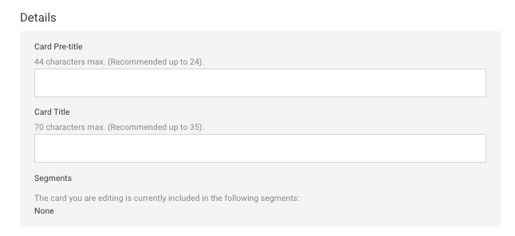
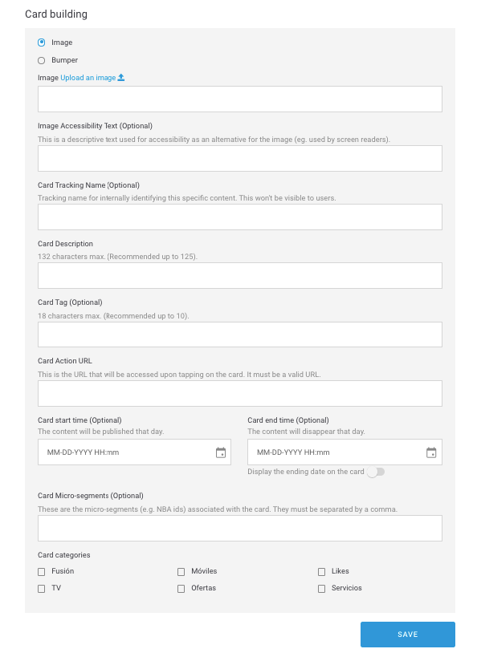
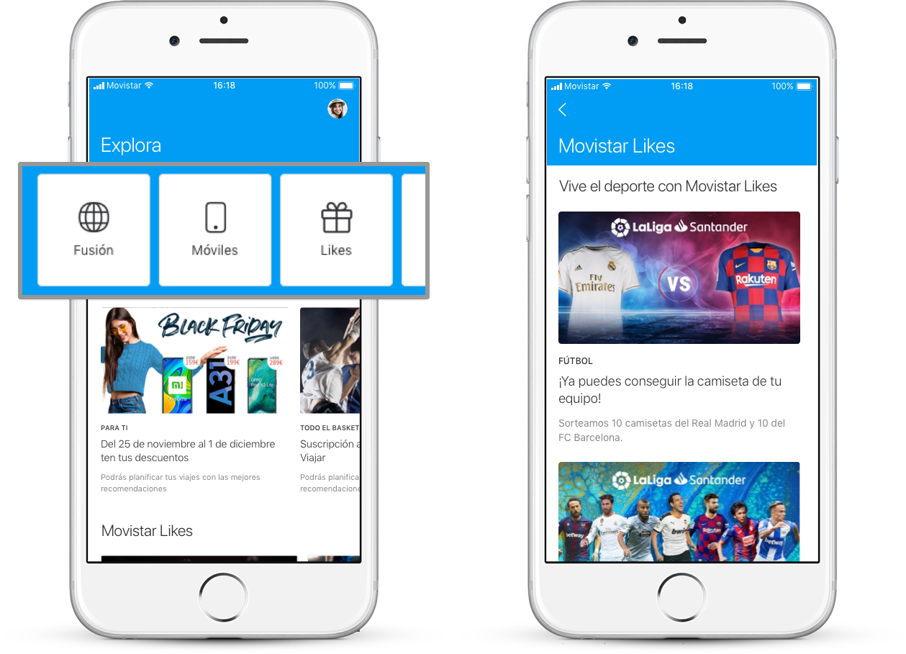
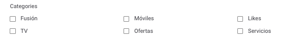

# En un módulo Featured Content

Para que un módulo de tipo _Featured Content_ se visualice en la app tiene que tener un mínimo de de 2 _cards_ y un máximo de 6.

### Details

**Card Pre-title**. Título que aparece inmediatamente debajo de la imagen del carrusel.  
🔅Tiene una longitud máxima de **44 caracteres** \(recomendado menos de 24\) y es **obligatorio**.

**Card Title**. Título que aparece debajo del **Pre-title** y que identifica a la _card_ internamente.  
🔅Tiene una longitud máxima de **70 caracteres** \(recomendado menos de 35 para no ocupar más de una línea\) y es **obligatorio**.

**Segments**. Segmento o segmentos en los que está incluida la card.  
 ℹ Campo informativo, no editable.

### Card building

Para cada _card_ los campos disponibles varían en función de que selecciones una imagen o un _bumper_:

* **Image**. Muestra una imagen estática.
* **Bumper**. Muestra un vídeo corto o animación.

💡 **¿Sabías que?**

Un _bumper_ es un vídeo corto o animación. Es un formato por lo general estándar con una duración media de 6 segundos aproximadamente y suele usarse con fines comerciales.




**Image Upload an image** 📤. URL de la imagen de la _card_. Tiene que tener el formato de URL propio del CMS.

Haz clic en el enlace **Upload an image** 📤 _\*\*_y selecciona la imagen directamente desde de tu ordenador. Una vez procesada la subida de la imagen, la URL se autocompleta en el campo de texto.

Cuando la imagen se haya subido se previsualiza justo debajo.

🔅Este campo es **obligatorio**.

**Image Accesibility Text**. Descripción de la imagen que se usa para la accesibilidad como alternativa si la imagen no se puede mostrar \(por ejemplo, para personas con problemas de visión\).

🔅No tiene una longitud máxima y es **opcional**.




**Bumper Upload a bumper** 📤. Se autorrellena con el nombre del _bumper_.

Para subir un bumper tienes dos opciones:

1. Haz clic en el enlace **Upload a bumper** 📤 y sube un _bumper_ desde tu ordenador.
2. Despliega la lista de los _bumpers_ y selecciona uno de los que ya haya subidos.

Activa la opción **Play in loop** para que el _bumper_ se reproduzca en bucle en Explore. Con la opción desactivada se reproduce cada vez que el _bumper_ entre en pantalla pero se para cuando termina la reproducción.

Cuando el _bump\_e\_r_ se haya subido se previsualiza justo debajo:

**Bumper Accesibility Text**. Descripción del _bumper_ que se usa para la accesibilidad como alternativa si el _bumper_ no se puede mostrar \(por ejemplo, para personas con problemas de visión\).

🔅No tiene una longitud máxima y es **opcional**.



**Tracking Tag**. Representa la categoría de productos. Aunque el usuario no ve este nombre tal cual, sí que se usa para formar el nombre final que se ve en Google Analytics. Sirve para identificar el producto internamente de manera más fácil.    
🔅Es obligatorio. 

**Tracking Name Description**. Representa el nombre del producto. Aunque el usuario no ve este nombre tal cual sí se usa para formar el nombre final que se ve en Google Analytics.    
🔅Es obligatorio. 

**Card Description**. Pequeña descripción de la _card_.  
🔅Tiene una longitud máxima de **132 caracteres** \(recomendado menos de 125\) y es **obligatorio**.

**Card Tag**. Texto corto que se sitúa por encima de la imagen de la _card_.  
🔅Tiene una longitud máxima de **18 caracteres** \(recomendado menos de 10\) y es **opcional**.

**Card Action Url**. URL de la _card_, es decir, URL a la que se accede al hacer clic sobre la _card_.  
🔅Es **obligatoria** y tiene que ser una URL válida \(ejemplo: [https://www.google.com](https://www.google.com)\)

**Card start time**. Fecha y hora en la que quieres que la _card_ empiece a mostrarse a los usuarios.  
🔅Es opcional.

**Card end time**. Fecha y hora en la que quieres que la _card_ termine de mostrarse a los usuarios.  
🔅Es opcional.

**Display the ending date on the card**. Activa esta opción para informar al usuario que el contenido va a caducar.

**¿Cómo se visualiza la fecha de caducidad?**

Si has habilitado la opción de mostrar la fecha de caducidad, cómo se muestre esa fecha depende del día en que expire la _card_.

`TERMINA HOY hh:mm AM` o `TERMINA HOY hh:mm PM` o `TERMINA HOY hh:mm` \(el formato varía en función del país\) para indicar que la _card_ caduca en el mismo día a la hora indicada, por la mañana o por la tarde, respectivamente. Por ejemplo `TERMINA HOY 9:00AM`.

`TERMINA MAÑANA` para indicar que la fecha de caducidad es al día siguiente.

`TERMINA dd mm` para indicar que la diferencia es de más de dos días. Por ejemplo `TERMINA 30 JUN`.

🎯 La fecha de comienzo y fin son una manera de programar algunas campañas, especialmente aquellas de carácter estacional.

**Card Micro-segments**. Etiquetas que puedes añadir, siempre separadas por comas, para hacer una segmentación de los usuarios que van a ver el contenido que estás creando.  
🔅Es **opcional**.


Recuerda que tienes que configurar un mínimo de 2 _cards_.

Los campos para todas las cards son los mismos.


**Card categories**

Las categorías te permiten filtrar el contendido en Explore. Las categorías se muestran en la parte superior, a modo de carrusel horizontal, de modo que el usuario puede navegar por las categorías y seleccionar la que quiera ver.

Cuando el usuario selecciona una categoría el contenido se muestra filtrado, para que el usuario no se pierda ningún contenido relacionado con esa categoría.

En Explore CMS selecciona la categoría o las categorías que aplican a la card que estás configurando:

🔅Es **obligatorio** indicar al menos una categoría.


Las categorías disponibles y los nombres de las categorías varían en función de la OB.


* **Fusión**. Paquetes: packs, planes, paquetes de productos.
* **Móviles**. Dispositivos: smartphones, tablets.
* **Likes**. Fidelización: membresía, contenido de programas de loyalty/fidelización \(Valoriza, Priority, Club Movistar…\)
* **TV**. Televisión: planes de televisión, contenido destacado.
* **Ofertas**. Promociones: Contenido promocional que pueda encajar y que es posible que incluso pueda convivir con otras categorías.
* **Servicios**. Servicios: servicios de valor añadido \(nuevas funcionalidades\), apps, servicios de TEF. 


🙋 **Ten en cuenta que...**

Por defecto, cuando un usuario abre Explore, ve todo el contenido, todas las cards configuradas, y por tanto la categoría seleccionada es siempre **All**.

La categoría **All**, que es la primera que se visualiza, no es una categoría como tal sino que es la forma que tiene el usuario de ver todo el contenido.


🎯 **Buenas prácticas**: No es recomendable que un contenido tenga asignada más de una categoría, aunque Explore CMS no limite este comportamiento. A nivel de medición de datos es más sencillo imputar acciones cuando una card está asociada a una única categoría.

🤔 **¿Qué debo tener en cuenta cuando uso las categorías?**

¡Consulta la sección [**Categorías**](https://app.gitbook.com/@tef-novum/s/explore-cms/~/drafts/-LyYX2WN5Qc794RVRWmG/faq#categorias) del [FAQ](../../faq.md) para resolver todas tus dudas!

Haz clic en **SAVE** para guardar los cambios y crear la card o haz clic en **CANCEL** para salir sin guardar.

