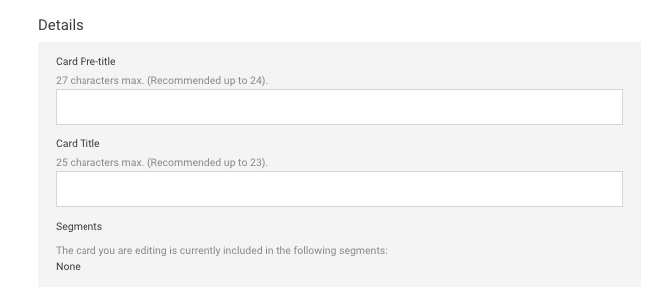
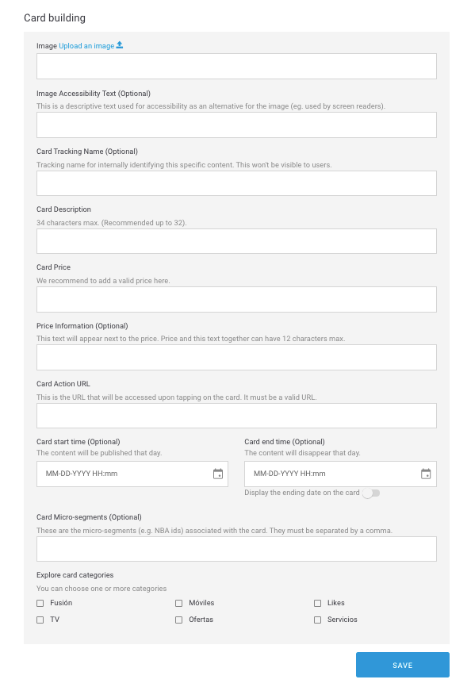

# En un módulo Rows

Configura un mínimo de 2 filas y un máximo de 3. Para cada fila los campos disponibles son:

### Details

**Card Pre-tiltle**. Pequeño texto destacado previo al título \(ejemplo `30 DÍAS GRATIS`\).  
🔅 Tiene una longitud máxima de **27 caracteres** \(recomendado menos de 24\) y es **opcional**.

**Card Title**. Título de la oferta/plan que aparece al lado de la imagen \(ejemplo: `Plan BIG 20 Gigas`\).  
🔅Tiene una longitud máxima de **25 caracteres** \(recomendado menos de 23\) y es **obligatorio**.

**Segments**. Segmento o segmentos en los que está incluida la card.  
 ℹ Campo informativo, no editable.

### Card building

**Image URL - Upload an image** 📤 . URL de la imagen de la fila. Tiene que tener el formato de URL propio del CMS.

Haz clic en el enlace **Upload an image** 📤 y selecciona la imagen directamente desde de tu ordenador. Una vez procesada la subida de la imagen, la URL se autocompleta en el campo de texto.

Cuando la imagen se haya subido se previsualiza justo debajo.

🔅 No tiene una longitud máxima y es **obligatorio**.

**Image Accessibility Text**. Descripción de la imagen que se usa para la accesibilidad como alternativa si la imagen no se puede mostrar \(por ejemplo, para personas con problemas de visión\).  
🔅 No tiene una longitud máxima y es **opcional**.

**Card Tracking Name**. Nombre que no ven los usuarios pero sí se ve en Google Analytics. Sirve para identificar el producto internamente de manera más fácil.  
🔅Es **opcional**.

**Card Description**. Breve descripción del producto presentado. La descripción se muestra debajo del título.  
🔅Tiene una longitud máxima de **34 caracteres** \(recomendado menos de 32\) y es **obligatorio**.

**Card Price**. Precio que se muestra debajo de la descripción, junto a la imagen. No olvides indicar siempre un precio válido \(ejemplo `$123`\)  
🔅No tiene una longitud máxima y es **obligatorio**.

**Price Information**. Texto para aportar información adicional acerca del precio. Se muestra junto al precio, con un estilo más discreto y precedido de `/` \(ejemplo `al mes`\).  
🔅Tiene una longitud máxima de **12 caracteres** \(estos caracteres incluyen también el **Card Price**\) y es **opcional**.

**Card Action URL**. URL de la fila, es decir, URL a la que se accede al hacer clic sobre la fila.  
🔅Es **obligatoria** y tiene que ser una URL válida \(ejemplo: [`https://www.google.com`](https://www.google.com)\)

**Card start time**. Fecha y hora en la que quieres que el contenido empiece a mostrarse a los usuarios.  
🔅Es opcional.

**Card end time**. Fecha y hora en la que quieres que el contenido termine de mostrarse a los usuarios.  
🔅Es opcional.

**Display the ending date on the card**. Activa esta opción para informar al usuario que el contenido va a caducar.

**¿Cómo se visualiza la fecha de caducidad?**

Si has habilitado la opción de mostrar la fecha de caducidad, cómo se muestre esa fecha depende del día en que expire la _card_.

`TERMINA HOY hh:mm AM` o `TERMINA HOY hh:mm PM` o `TERMINA HOY hh:mm` \(el formato varía en función del país\) para indicar que la _card_ caduca en el mismo día a la hora indicada, por la mañana o por la tarde, respectivamente. Por ejemplo `TERMINA HOY 9:00AM`.

`MAÑANA` indica que la fecha de caducidad es al día siguiente.

`TERMINA dd mm` para indicar que la diferencia es de más de dos días. Por ejemplo `TERMINA 30 JUN`.

🎯 La fecha de comienzo y fin son una manera de programar algunas campañas, especialmente aquellas de carácter estacional.

**Card Micro-segments**. Etiquetas que puedes añadir, siempre separadas por comas, para hacer una segmentación de los usuarios que van a ver el contenido que estás creando.  
🔅Es **opcional**.

**Card 1 categories**

Las categorías te permiten filtrar el contendido en Explore. Las categorías se muestran en la parte superior, a modo de carrusel horizontal, de modo que el usuario puede navegar por las categorías y seleccionar la que quiera ver.

Cuando el usuario selecciona una categoría el contenido se muestra ordenado en formato vertical \(en lugar de scroll horizontal\), para que el usuario no se pierda ningún contenido.

En Explore CMS selecciona la categoría o las categorías que aplican a la card que estás configurando:

🔅Es **obligatorio** indicar al menos una categoría.


Las categorías disponibles y los nombres de las categorías varían en función de la OB.


* **Fusión**. Paquetes: packs, planes, paquetes de productos.
* **Móviles**. Dispositivos: smartphones, tablets.
* **Likes**. Fidelización: membresía, contenido de programas de loyalty/fidelización \(Valoriza, Priority, Club Movistar…\)
* **TV**. Televisión: planes de televisión, contenido destacado.
* **Ofertas**. Promociones: Contenido promocional que pueda encajar y que es posible que incluso pueda convivir con otras categorías.
* **Servicios**. Servicios: servicios de valor añadido \(nuevas funcionalidades\), apps, servicios de TEF. 


🙋 **Ten en cuenta que...**

Por defecto, cuando un usuario abre Explore, ve todo el contenido, todas las cards configuradas, y por tanto la categoría seleccionada es siempre **All**.

La categoría **All**, que es la primera que se visualiza, no es una categoría como tal sino que es la forma que tiene el usuario de ver todo el contenido.


🎯 **Buenas prácticas**: No es recomendable que un contenido tenga asignada más de una categoría, aunque Explore CMS no limite este comportamiento. A nivel de medición de datos es más sencillo imputar acciones cuando una card está asociada a una única categoría.

🤔 **¿Qué debo tener en cuenta cuando uso las categorías?**

¡Consulta la sección [**Categorías**](https://app.gitbook.com/@tef-novum/s/explore-cms/~/drafts/-LyYX2WN5Qc794RVRWmG/faq#categorias) del [FAQ](../../faq.md) para resolver todas tus dudas!

Haz clic en **SAVE** para guardar los cambios y crear la card o haz clic en **CANCEL** para salir sin guardar.

