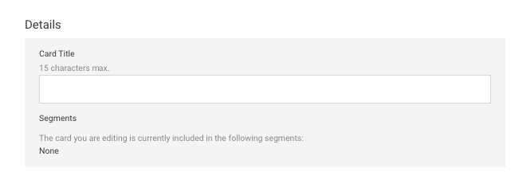
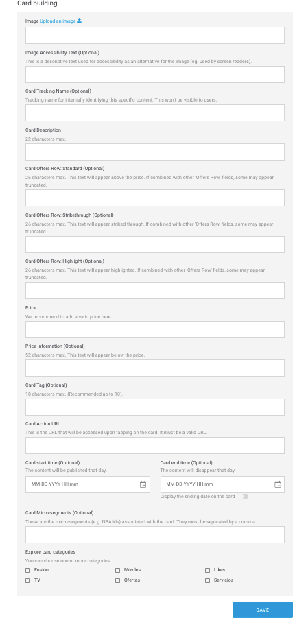
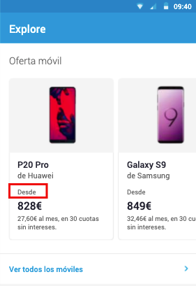
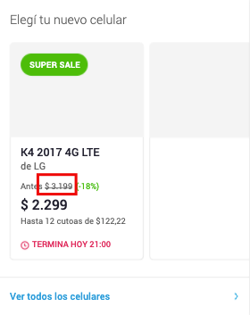
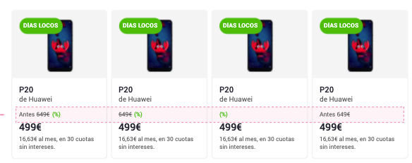
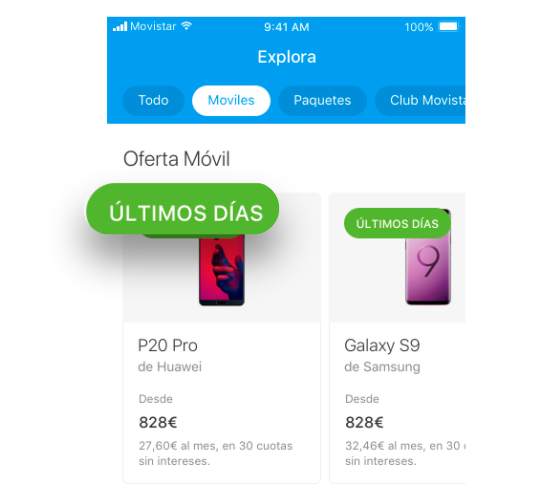

# En un módulo Vertical Cards

Para cada _card_ los campos disponibles son:

### Details

**Card Title**. Título de la card que aparece bajo la imagen. Además, identifica internamente a la card \(ejemplo: `iPhone X`\).  
🔅Tiene una longitud máxima de **15 caracteres** y es **obligatorio**.

**Segments**. Segmento o segmentos en los que está incluida la card.  
 ℹ Campo informativo, no editable.

### Card building

**Image - Upload an image** 📤 . URL de la imagen de la _card_. Tiene que tener el formato de URL propio del CMS.

Haz clic en el enlace **Upload an image** 📤 y selecciona la imagen directamente desde de tu ordenador. Una vez procesada la subida de la imagen, la URL se autocompleta en el campo de texto.

Cuando la imagen se haya subido se previsualiza justo debajo.

🔅No tiene una longitud máxima y es **opcional**.

**Image Accessibility Text**. Descripción de la imagen que se usa para la accesibilidad como alternativa si la imagen no se puede mostrar \(por ejemplo, para personas con problemas de visión\).  
🔅No tiene una longitud máxima y es **obligatorio**.

**Tracking Tag**. Representa la categoría de productos. Aunque el usuario no ve este nombre tal cual, sí que se usa para formar el nombre final que se ve en Google Analytics. Sirve para identificar el producto internamente de manera más fácil.    
🔅Es obligatorio. 

**Tracking Name Description**. Representa el nombre del producto. Aunque el usuario no ve este nombre tal cual sí se usa para formar el nombre final que se ve en Google Analytics.    
🔅Es obligatorio. 

**Card Description**. Breve descripción del producto presentado \(ejemplo: `by Apple`\).  
🔅Tiene una longitud máxima de **22 caracteres** y es **obligatorio**.

**Card Offers Row**: **Standard**. Texto que se muestra sobre el precio de la _card_, con un estilo normal \(ejemplo: `Desde`\). Combinado con otros campos de **Offers Row** los últimos campos se pueden ver afectados si usas todos los disponibles.  
🔅Tiene una longitud máxima de **26 caracteres** y es **opcional**.

**Card Offers Row: Strikethrough**. Texto que se muestra en la card, con un estilo tachado \(por ejemplo para indicar una rebaja en el precio ~~`345€`~~ \). Combinado con otros campos de **Offers Row** los últimos campos se pueden ver afectados si usas todos los disponibles.  
 🔅Tiene una longitud máxima de **26 caracteres** y es **opcional**.

**Card Offers Row: Highlight**. Texto que se muestra sobre el precio de la _card_, con un estilo destacado \(ejemplo: `-18%`\). Combinado con otros campos de **Offers Row** los últimos campos se pueden ver afectados si usas todos los disponibles.  
🔅Tiene una longitud máxima de **26 caracteres** y es **opcional**.

Aquí tienes un conjunto de ejemplos de combinaciones de campos de **Offers Row**:

**Price**. Precio que se muestra debajo del título y la descripción. No olvides indicar siempre un precio válido \(ejemplo `$123`\).  
🔅No tiene una longitud máxima y es **obligatorio**.

**Price Information.** Texto para aportar información adicional acerca del precio. Se muestra debajo. En función del número de caracteres ocupa una o dos líneas \(ejemplo `Hasta 12 meses sin intereses`\).  
🔅Tiene una longitud máxima de **52 caracteres** y es **opcional**.

**Card Tag**. Texto corto que se sitúa por encima de la imagen de la _card_.  
🔅Tiene una longitud máxima de **18 caracteres** \(recomendado menos de 10\) y es **opcional**.

**Card Action Url**. URL de la _card_, es decir, URL a la que se accede al hacer clic sobre la _card_.  
🔅Es **obligatoria** y tiene que ser una URL válida \(ejemplo: [`https://www.google.com`](https://www.google.com)\)

**Card start time**. Fecha y hora en la que quieres que la _card_ empiece a mostrarse a los usuarios.  
🔅Es **opcional**.

**Card end time**. Fecha y hora en la que quieres que la _card_ termine de mostrarse a los usuarios.  
🔅Es **opcional**.

**Display the ending date on the card**. Activa esta opción para informar al usuario que el contenido va a caducar.

**¿Cómo se visualiza la fecha de caducidad?**

Si has habilitado la opción de mostrar la fecha de caducidad, cómo se muestre esa fecha depende del día en que expire la _card_.

`TERMINA HOY hh:mm AM` o `TERMINA HOY hh:mm PM` o `TERMINA HOY hh:mm` \(el formato varía en función del país\) para indicar que la _card_ caduca en el mismo día a la hora indicada, por la mañana o por la tarde, respectivamente. Por ejemplo `TERMINA HOY 9:00AM`.

`MAÑANA` indica que la fecha de caducidad es al día siguiente.

`TERMINA dd mm` para indicar que la diferencia es de más de dos días. Por ejemplo `TERMINA 30 JUN`.

🎯 La fecha de comienzo y fin son una manera de programar algunas campañas, especialmente aquellas de carácter estacional.

**Card Micro-segments**. Etiquetas que puedes añadir, siempre separadas por comas, para hacer una segmentación de los usuarios que van a ver el contenido que estás creando.  
🔅Es **opcional**.


Recuerda que tienes que configurar un mínimo de 2 _cards_.

Los campos para todas las cards son los mismos.


**Card categories**

Las categorías te permiten filtrar el contendido en Explore. Las categorías se muestran en la parte superior, a modo de carrusel horizontal, de modo que el usuario puede navegar por las categorías y seleccionar la que quiera ver.

Cuando el usuario selecciona una categoría el contenido se muestra filtrado, para que el usuario no se pierda ningún contenido relacionado con esa categoría.

En Explore CMS selecciona la categoría o las categorías que aplican a la card que estás configurando:

🔅Es **obligatorio** indicar al menos una categoría.


El nombre de la categoría **Destacados** varía en función de la OB.


* **Destacados.** Las cards que tengan esta categoría asignada son las que se muestran en la Home de Explore cuando el usuario aterriza por primera vez, sin seleccionar ninguna categoría.

  Si la card no tiene selecciona esta categoría entonces no se muestra al inicio y se mostrará solo cuando el usuario seleccione la categoría que tenga asignada.

  🤓 Recuerda que puedes asignar más de una categoría por card.

* **Fusión**. Paquetes: packs, planes, paquetes de productos.
* **Móviles**. Dispositivos: smartphones, tablets.
* **Likes**. Fidelización: membresía, contenido de programas de loyalty/fidelización \(Valoriza, Priority, Club Movistar…\)
* **TV**. Televisión: planes de televisión, contenido destacado.
* **Ofertas**. Promociones: Contenido promocional que pueda encajar y que es posible que incluso pueda convivir con otras categorías.
* **Servicios**. Servicios: servicios de valor añadido \(nuevas funcionalidades\), apps, servicios de TEF. 


🙋 **Ten en cuenta que...**

Por defecto, cuando un usuario abre Explore, ve el contenido que tenga asignada la categoría **Destacados**

Así pues, tienes varias opciones

1. Que el contenido solo se vea en la Home, al inicio, cuando el usuario abre Explore. Para eso asígnale solo la categoría **Destacados**.
2. Que el contenido se vea en la Home y además en otra u otras categorías. Para eso asígnale la categoría **Destacados** y la otra u otras categorías en las que quieras que se muestre.
3. Que el contenido NO se muestre en la Home y sí en otra u otras categorías. Para eso asígnale la categoría o categorías en las que quieras que se muestre.


🎯 **Buenas prácticas**: Lo recomendable es que el contenido tenga asignadas, como máximo, dos categorías y que una de ellas sea **Destacados** \(si quieres que se muestre en la Home\). Aunque Explore CMS no limite este comportamiento, a nivel de medición de datos es más sencillo imputar acciones cuando una card está asociada a una única categoría \(y a **Destacados** si es necesario\). 

🤔 **¿Qué debo tener en cuenta cuando uso las categorías?**

¡Consulta la sección [**Categorías**](https://app.gitbook.com/@tef-novum/s/explore-cms/~/drafts/-LyYX2WN5Qc794RVRWmG/faq#categorias) del [FAQ](../../faq.md) para resolver todas tus dudas!

Haz clic en **SAVE** para guardar los cambios y crear la card o haz clic en **CANCEL** para salir sin guardar.

