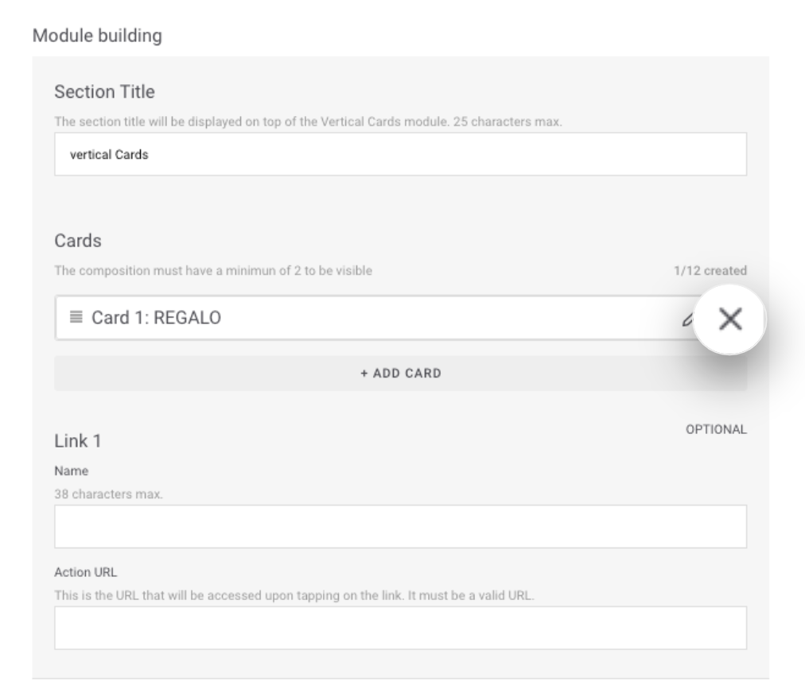

# Eliminar card de un módulo

Para eliminar una card de un módulo edita ese módulo.

Para [editar un módulo](../modulo/editar-modulo.md) haz clic en  en la línea del módulo. En la sección **Module building** del módulo haz clic en  en la card que quieres eliminar del módulo.

La card dejará de mostrarse en ese módulo pero seguirá siempre disponible en la lista de cards para poder ser reutilizada en ese momento.

Si además la card se estaba usando en otro u otros módulos continuará mostrándose.


\*\*\*\*🤓 **Recuerda que...**

* Las cards pueden eliminarse de los módulos.
* Si quieres eliminar la card de todos los módulos en los que está accede a cada módulo y elimínala.
* Las cards siempre están disponibles para reusarse aunque las hayas eliminado de todos los módulos. 


