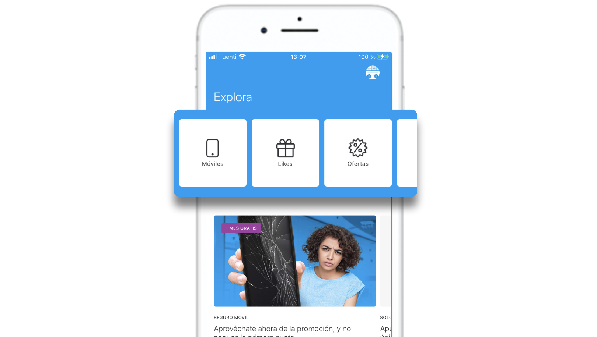

# Categoría

Las categorías permiten a los usuarios poder consumir, filtrado, el contenido de Explore. Estas categorías se muestran en la parte superior de Explore.

La creación y la gestión de categorías está disponible desde el menú lateral izquierdo **Explore &gt; Explore Categories**.

### Crear una categoría

Para crear una categoría accede a **Explore &gt; Explore Categories** y haz clic en **Add category**.

Para cada nueva categoría rellena los siguientes campos:

**Internal name**. Es el nombre interno que identifica la categoría. Este nombre no se muestra en la app en ningún momento pero sí se utiliza para crear el deep link que identifica la categoría. También es el nombre que se usa en Google Analytics para identificar esa categoría.  
🔅Es un campo **obligatorio**.


Pese a que es un nombre interno asegúrate de crearlo correctamente porque una vez generada la categoría **no puedes modificar** este campo.


**Category nam**e. Es el nombre de la categoría que ven los usuarios ven en la sección de Explore.  
🔅Tiene una longitud máxima de **11 caracteres** y es **obligatorio**.

**Icon**. Selecciona el icono para que se muestre en la app sobre el nombre de la categoría. 

