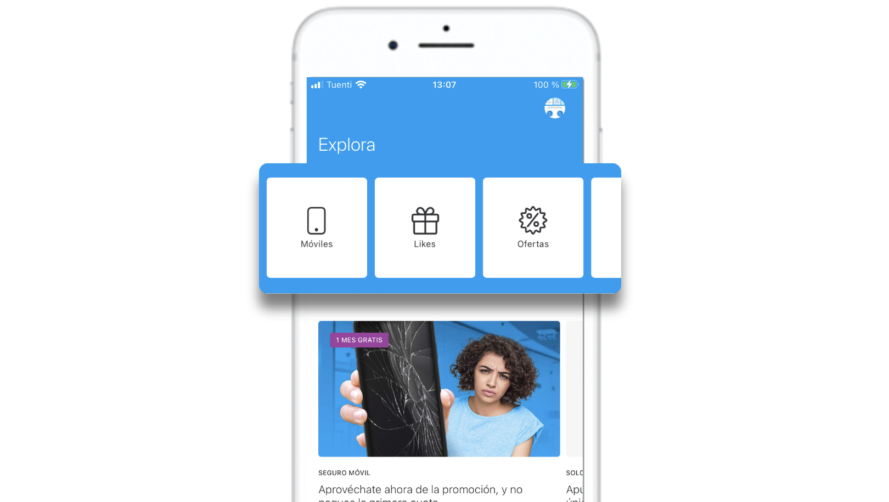

# Categoría

Las categorías permiten a los usuarios poder consumir, filtrado, el contenido de Explore. Estas categorías se muestran en la parte superior de Explore.

La creación y la gestión de categorías está disponible desde el menú lateral izquierdo **Explore &gt; Explore Categories**.

