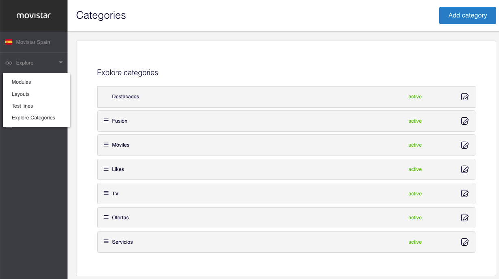
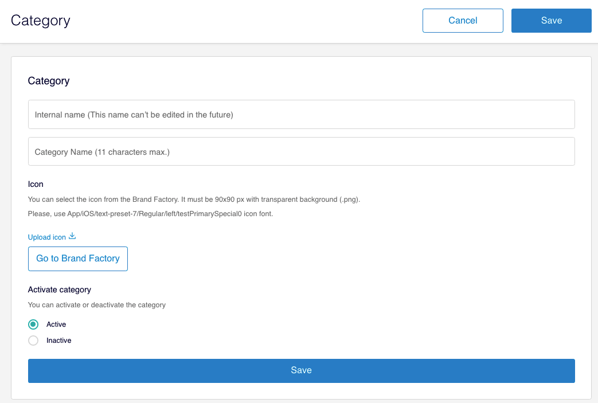
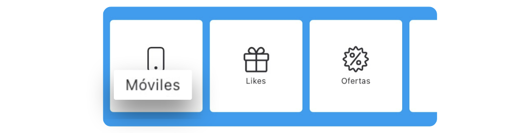
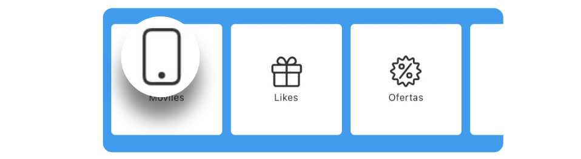

# Crear categoría

Para crear una categoría accede a **Explore &gt; Explore Categories** y haz clic en **Add category**.

Para cada nueva categoría rellena los siguientes campos:​‌

#### Category 

**Internal name**. Es el nombre interno que identifica la categoría. Este nombre no se muestra en la app en ningún momento pero sí se utiliza para crear el deep link que identifica la categoría. También es el nombre que se usa en Google Analytics para identificar esa categoría.   
🔅Es un campo **obligatorio**


El valor de **Internal name** tiene que cumplir lo siguiente:

* Empezar por minúscula de la a a la z \(nada de caracteres especiales ni acentos\).
* Después, vale cualquier combinación de caracteres de la a a la z minúscula \(nada de caracteres especiales ni acentos\), guiones medios y guiones bajos, y números.


|   👎 Ejemplos incorrectos  | 👍 Ejemplos correctos  |
| :--- | :--- |
| `TelevisionInternet` | `television_internet` |
| `Descuento 30` | `descuento30` |
| `100_gigasGratis` | `gigas_gratis100` |
| `díaDeLaMadre` | `dia-de-la-madre` |


Pese a que es un nombre interno asegúrate de crearlo correctamente porque una vez generada la categoría **no puedes modificar** este campo.




Si necesitas más información sobre deep links consulta esta sección ​👇

**Category name**. Es el nombre de la categoría que ven los usuarios en la sección de Explore.  
🔅Tiene una longitud máxima de **11 caracteres** y es **obligatorio**.

**Icon**. Selecciona el icono para que se muestre en la app sobre el nombre de la categoría. Dispones de dos opciones para subir los iconos:

Para añadir un icono directamente desde tu equipo haz clic en **Upload icon** 📥.  
🔆 El icono tiene que tener unas **medidas de 90x90px** y formato **`.png`**

Para añadir un icono de la librería de Brand Factory haz clic en el botón **Go to Brand Factory**. 


👩💻 Para poder añadir iconos desde BrandFactory necesitas estar logado con tu cuenta de empleado de Telefónica. 

El icono, además, debe cumplir el siguiente requisito:  
`App/iOS/text-preset-7/Regular/left/testPrimarySpecial0 icon Font`



El color del icono se cambia automáticamente, no tienes que hacer nada especial 😉 .


**Activate category**

**Active**. Es el estado por defecto con el que se crean las categorías. Las categorías en estado **Activado** son las que se muestran como categorías asignables en las cards.

**Inactive**. La categoría marcada con este estado no se muestra en la lista de categorías disponibles en las cards.

Haz clic en **Save** para guardar los cambios.

