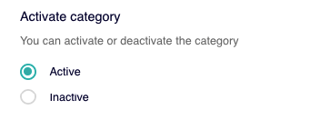

# Desactivar o activar categoría

Cuando creas una categoría, por defecto, aparece activada. Es decir, la categoría se muestra en la lista de categorías disponibles cuando estás creando o editando un módulo.


Recuerda que la categoría **Destacados** es especial y es una categoría que siempre está visible.


Para configurar la visibilidad de una categoría accede a **Explore &gt; Explore Categories** y haz clic en en el icono  de la categoría a la que quieres modificar la visibilidad.

#### Desactivar categoría

Para desactivar una categoría, en la sección **Activate category**, selecciona la opción **Inactive**. 

Se te muestra un mensaje de confirmación que te recuerda que si desactivas la categoría las cards que la tengan asignada no se mostrarán. Haz clic en el botón **YES** para confirmar que quieres desactivar la categoría.


Recuerda que cuando desactivas una categoría suceden dos cosas:

1⃣ La categoría deja de estar disponible y por tanto no se muestra en el listado de categorías cuando configures una card en el futuro.

2⃣ Las cards que tengan asignada esa categoría que desactivas dejarán de verse en Explore \(salvo que tengan asignada además otra u otras categorías que sí estén activas\)


#### Activar categoría

Para activar una categoría, en la sección **Activate category**, selecciona la opción **Active**. 

Se te muestra un mensaje de confirmación para que confirmes que realmente quieres activar la categoría. Haz clic en **YES** para confirmarlo.

Para guardar los cambios haz clic en **Save** en la ficha de la categoría. 


Si no guardas los cambios, aunque hayas confirmado la activación/desactivación de la card, los cambios no se hacen efectivos.


