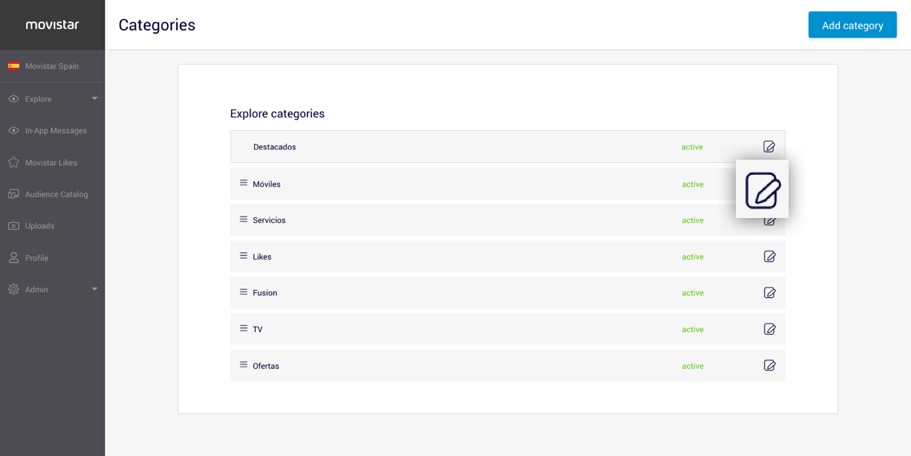
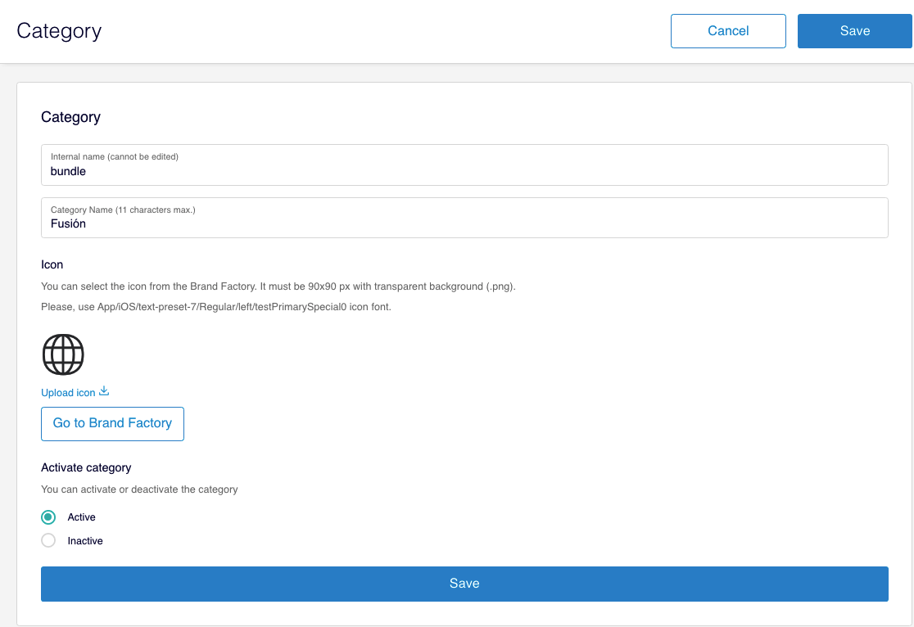

# Editar categoría

Para editar una categoría accede a **Explore &gt; Explore Categories** y haz clic en en el icono  de la categoría que quieras editar.

Edita el campo o los campos de la categoría, a excepción del campo **Internal name** que, como se explica en la sección [Categoría](https://tef-novum.gitbook.io/explore-cms/-Lspy87NfjR-3ugs1jWV/categoria/crear-categoria#category), no se puede modificar.


En la categoría **Destacados** solo puedes cambiar el nombre que se muestra en la pestaña Explora. El resto de campos no son editables y esta categoría no se puede ocultar dado que es la que representa la página de aterrizaje de Explore en la app.

Además, esta categoría siempre aparece en primer lugar.


Haz clic en **Save** para guardar los cambios.

