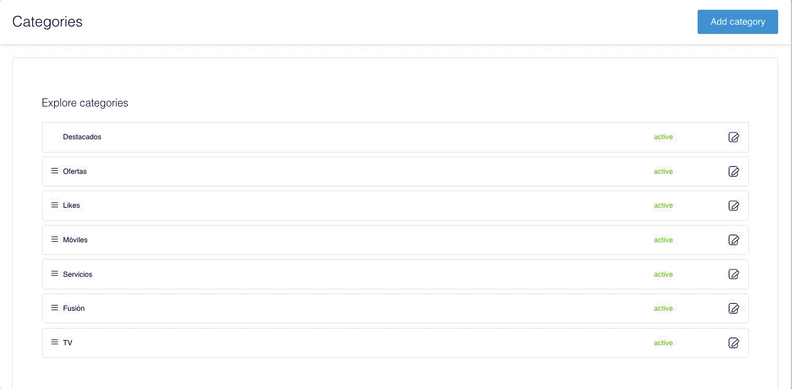

# Ordenar categorías

Las categorías se muestran ordenadas, en la parte superior de Explore, según el orden que tengas configurado en el CMS.


La primera categoría, **Destacados** \(o el nombre que quieras otorgarle\), permanece siempre fija en primera posición porque representa la página de aterrizaje de Explore.


Para mover una categoría selecciónala con el ratón, sin soltarla, y muévela arriba o abajo hasta la posición que quieras \(_drag&drop_\). No es necesario que guardes los cambios dado que Explore muestra las categorías según el orden en que las tengas colocadas, apareciendo en primera posición la que está más arriba y así sucesivamente.

