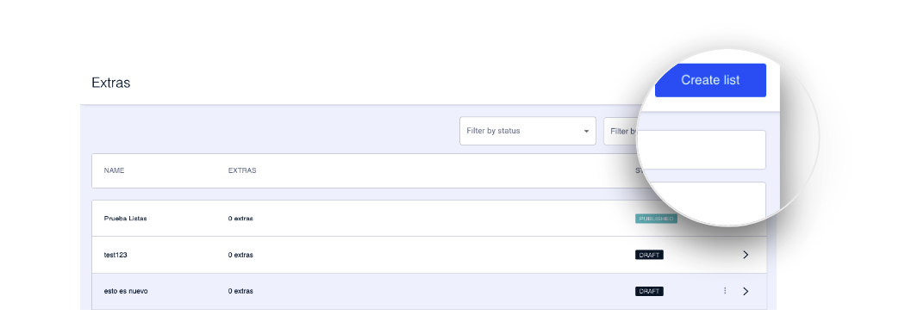

# Cómo crear una lista

El primer paso para crear un extra es crear, previamente, una lista. En esa lista se integran después los extras que correspondan.

Haz clic en **Create list** para crear una lista de extras o haz clic en una lista ya existente para incluirlo en esa lista.

El proceso de creación de listas está dividido en varios pasos.

**Paso 1. Overview**. En este paso se configura la información general de la lista (Nombre interno, ID, etc.)


[overview.md](overview.md)


**Paso 2. Content**. Aquí se configura la parte más visual de la lista y es donde se gestionan los extras.


[contenido.md](contenido.md)


**Paso 3. Preview**. El último paso, a modo de resumen, y desde el que además puedes [crear un test](../como-hacer-un-test.md) para validar la configuración antes de impactar a una masa amplia de clientes.


[vista-previa.md](vista-previa.md)

