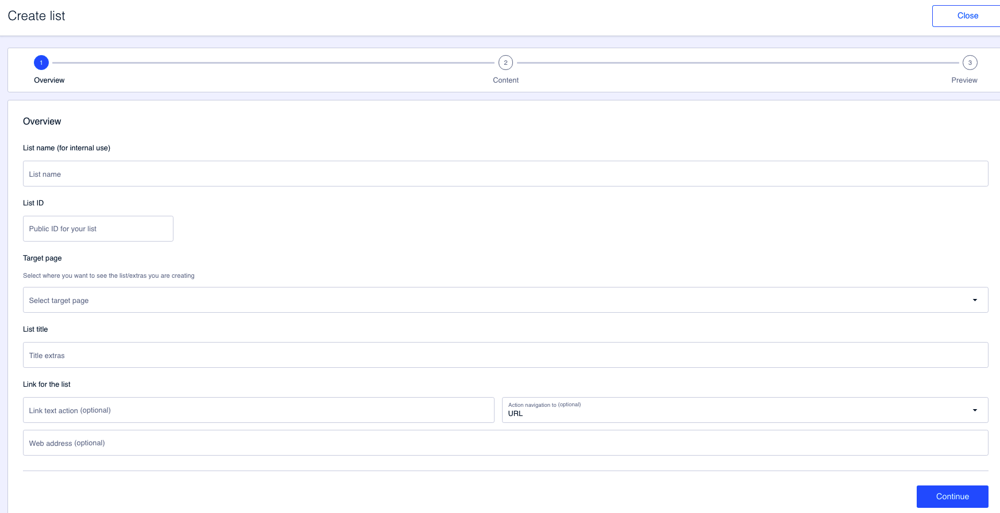

# Overview

En este primer paso aporta la información general sobre la lista.

Rellena los siguientes campos:

**List name (for internal use)**. Nombre de la lista que estás creado. Es un campo de uso interno y por tanto no se ve en la app en ningún momento.&#x20;

**List ID**. Este campo se rellena de manera automática cuando completas el campo **List name (for internal use)**. Puedes cambiar el valor propuesto pero ten en cuenta que este campo no admite espacios, tildes u otros caracteres especiales.&#x20;

**Target page**. Selecciona la página objetivo en la que se va a mostrar la lista que estás configurando.

**List title**. Indica el título de la lista. Este título es el que se muestra a los usuarios de la app. Este título aparece en la parte superior del grupo de extras.

**Link for the list**. De manera opcional, puedes añadir un enlace a la lista. Configura:

* **Link text action**. Este es el texto que será clicable
* **Action navigation to**. Selecciona aquí una de las dos opciones disponibles:
  * **URL**. Indica manualmente, en el campo Web address, la URL a la que dirigir al usuario cuando haga clic en el texto (el que has indicado en **Link text action**).&#x20;
  *   **Preconfigured**. Usa una de las URLs ya predefinidas que llevan al usuario a puntos concretos de la app.

      Si haces clic en **View ID information** puedes consultar la URL completa que se corresponde con la selección que has hecho.

Haz clic en **Continue** para pasar al siguiente paso.
