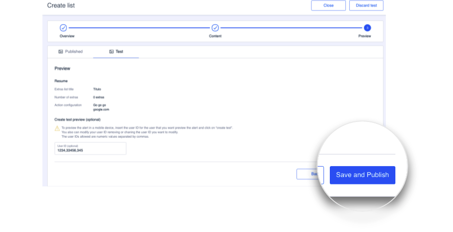
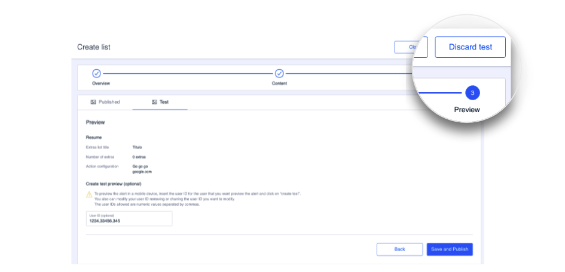

# Cómo hacer un test

Aunque en el apartado [Vista previa](como-crear-una-lista/vista-previa.md#como-crear-un-test) has podido comprobar cómo se inicia un test, a continuación puedes saber más sobre este proceso de pruebas de contenido:

### Cómo publicar el contenido de un test

Para empezar, sabrás que una lista de extras tiene un test en marcha gracias a la etiqueta de estado **TEST**:

Para publicar el contenido de un test accede a la lista de extras sobre la que está en marcha ese test.

Al abrir la lista, el contenido aparece dividido en dos pestañas para que puedas ver, en todo momento, el contenido previo al test y el propio contenido del test.


Solo puedes hacer cambios en el contenido si estás en la pestaña **Test**. Usa la otra pestaña para ver el contenido previo a los cambios que has hecho para el test.&#x20;


Cuando te hayas asegurado de que el contenido que tienes en la pestaña **Test**, en todos los pasos, es el contenido que quieres aplicar entonces haz clic en **Save and Publish**. Haz clic en **Yes** en el mensaje de confirmación.

Haz clic en **Close** para volver a la pantalla principal de listas de extra, **Extras Lists**.


:thumbsup:En la pantalla principal puedes comprobar que en el estado de la lista ha desaparecido la etiqueta **TEST**.


### Cómo descartar un test

Si tras probar el contenido de una lista de extras, con un Test en curso, decides descartar los cambios entonces accede a la lista de extras sobre la que está en marcha ese test.

Haz clic en **Continue** hasta llegar al último paso **Preview** y haz clic en **Discard test**.

Cuando descartas un test implica eliminar los cambios que habías hecho sobre la lista de extras y los propios extras y el contenido se crea como estaba previamente, antes del test.

### Como añadir, quitar o modificar los Novum user IDs de un test

Si necesitas editar el test para poder añadir, quitar o modificar los usuarios que pueden ver un determinado test entonces accede a esa lista.

En la pestaña **Test** puedes consultar, en el primer paso **Overview**, la información relativa al test: la descripción, quién lo ha iniciado y la fecha de creación.

Vete al último paso **Preview** para modificar los números de usuario. También para añadir user ID nuevos o eliminar lo que ya hay. Simplemente edita los valores del campo **User ID (optional)** y haz clic en **Save and Publish** para guardar los cambios.
