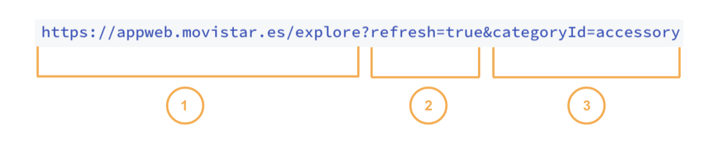

# Deep links por categorías

## 쯈ué es un deep link de Explore?

Un deep link de Explore es una enlace que, configurado con una serie de parámetros, lleva al usuario a un lugar concreto de la app. 

### **쮺칩mo se configura un deep link?**

Se construyen automáticamente teniendo en cuenta el valor del campo **Internal name** que rellenas al crear cada categoría.

Cuando creas una nueva categoría otorgas un valor al campo [**Internal name**](categoria/crear-categoria.md) y una vez que guardas la categoría ya no puedes editar ese valor, precisamente porque se tiene en cuenta para crear el deep link.

El deep link tiene siempre esta estructura:

`https://appweb.movistar.es/explore?refresh=true|false&categoryId=internalname`

Donde `internalname` es el valor del campo **Internal name** que le hayas dado al crear la categoría.


Ten en cuenta que el deep link varía en función de la OB. Asegúrate de estar usando la estructura correcta😉 

Amplía información sobre deep links en [Deeplinks Catalogue](https://tef-novum.gitbook.io/novum/develop/deeplinks-catalog).


## 쯈ué significan los parámetros que componen el deep link?

### Enlace

Destino, dentro de al app, al que lleva el enlace \(URL\). Para Explore, el enlace es:

[`https://appwebview.movistar.es/explore?`](https://appwebview.movistar.es/explore?)

### Parámetros

#### `refresh`

En función del valor de este parámetro, el contenido de Explore se refresca o no.

`refresh=true` La aplicación navega a la pestaña Explore y solicita el nuevo contendido, es decir, se refresca la información de esta pestaña.

`refresh=false` Si el deep link no tiene este parámetro o si el valor es `false` entonces el enlace te llevará igualmente a la pestaña de Explore pero no se refresca si hay contenido nuevo.

#### `categoryId`

Este parámetro recoge el valor del campo **Internal name**, que completas al crear una categoría.


El valor de **Internal name** tiene que cumplir lo siguiente:

* Empezar por minúscula de la a a la z \(nada de caracteres especiales ni acentos\).
* Después, vale cualquier combinación de caracteres de la a a la z minúscula \(nada de caracteres especiales ni acentos\), guiones medios y guiones bajos, y números.


Con este parámetro, el deep link hará que la aplicación navegue hasta la pestaña de Explore y mostrará el contenido filtrado por la categoría que hayas indicado en el parámetro `categoryId`.

Usa el caracter `?` para añadir más de un parámetro.

### Ejemplo de deep link para Explore

1 URL de la tab de Explore

2 El contenido se refresca

3 El deep link muestra el contendido filtrado por la categoría cuyo **Internal name** es `accesory`.

Por tanto, este ejemplo es un deep link que te muestra el contendido de Explore actualizado y filtrado por la categoría a la que pertenece el **Internal name** `accessory`.

