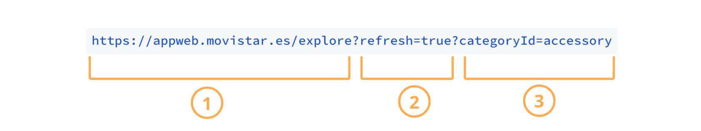

# Deeplinks en Explore

## ¿Cómo se construye un deeplink de Explore?

Un deeplink de Explore tiene las siguientes partes:

### Enlace

Destino, dentro de al app, al que lleva el enlace \(URL\). Para Explore, el enlace es:

[`https://appwebview.movistar.es/explore?`](https://appwebview.movistar.es/explore?)\`\`

### Parámetros

#### `refresh`

En función del valor de este parámetro, el contenido de Explore se refresca o no.

`refresh=true` La aplicación navega a la pestaña Explore y solicita el nuevo contendido, es decir, se refresca la información de esta pestaña. 

`refresh=false` Si no añades este parámetro o si el valor es `false` entonces el enlace te llevará igualmente a la pestaña de Explore pero no se refresca si hay contenido nuevo. 

#### `categoryId`

Usa este parámetro para mostrar el contenido filtrado en función de la Categoría. Los posibles valores de este parámetro son:

* `accessory`
* `bundle`
* `device`
* `loyalty`
* `promotion`
* `plan`
* `value_added_service`

Si añades este parámetro con uno de los valores indicados la aplicación navegará hasta la pestaña de Explore y mostrará el contenido filtrado por la categoría que hayas indicado en el parámetro `categoryId`.

Si asignas un valor diferente a los de la lista o simplemente no añades el parámetro `categoryId` en el deeplink entonces la aplicación navegará hasta la pestaña de Explore, a la categoría **Ver todo** que es lo mismo que no seleccionar ninguna categoría. En este caso no se filtra el contenido y se muestra todo.

Usa el caracter `?` para añadir más de un parámetro.

### Ejemplo de deeplink para Explore

1 URL de la tab de Explore

2 El contenido se refresca

3 El deeplink muestra el contendido filtrado por la categoría Accesorios.

Por tanto, este ejemplo es un deeplink que te muestra el contendido de Explore actualizado y filtrado por **Accesorios**.  

