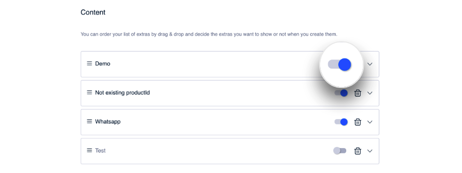

# Gestión de Extras

Como ya has visto, es en el paso [Contenido](como-crear-una-lista/contenido.md) desde donde configuras los extras. Pero además de crearlos y configurarlos, desde aquí puedes también gestionarlos: eliminar extra, cambiar el orden en el que se muestran dentro de la lista...

### Activar/Desactivar un extra&#x20;

Puedes cambiar la visibilidad el extra. Por defecto, cuando creas un extra, ese extra aparece activado, es decir, es visible para el usuario que cumpla las condiciones necesarias para verlo, es decir, pertenezca a la audiencia para la que se configura el extra.

Si por algún motivo prefieres ocultar ese extra usa el control para desactivarlo.&#x20;

Del mismo modo, activa un extra desactivado para que vuelva a aparecer.

Haz clic en **Save** para guardar los cambios. Ten en cuenta que si la lista está publicada salvar los cambios implica también publicarlos, aunque el sistema te pedirá confirmación.

### Eliminar un extra

Si estás completamente seguro de que no quieres volver a mostrar el extra y quieres eliminarlo, haz clic en .


Ten en cuenta que **borrar un extra** de una lista es una **acción irreversible**.&#x20;

:nerd:Si no estás del todo seguro es recomendable que en lugar de eliminar el extra lo desactives.


### Cambiar el orden&#x20;

El orden en el que se muestran los extras puedes controlarlo desde el CMS. Es tan sencillo como hacer _drag\&drop_, es decir, arrastrar y soltar a la posición deseada.

Se muestran en primer lugar los que están arriba.

