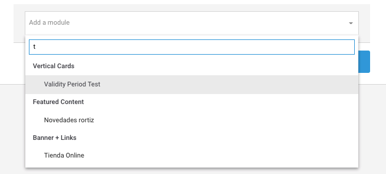

# Editar layout

Recuerda que un layout es una unidad de contenido formada por varios módulos. La composición completa de módulos es lo que el usuario ve en la aplicación. Este layout está basado en los segmentos o combinación de segmentos de usuarios a los que va dirigido el contenido \(prepago, contrato, sistema operativo\).

Los layouts actualmente disponibles dependen de la OB y sus características.

Para editar un layout existente en Explore CMS y poder publicarlo, accede al repositorio de layouts y haz clic en  en la fila del layout correspondiente.

En la cabecera del modo de edición del layout dispones de información sobre:

**Segment**. Segmento del layout: **Prepay** \(prepago\) o **Postpay** \(postpago\).

**Operating System.** Sistema operativo del segmento al que va dirigido el layout: **iOS** o **Android**.

## Layout building

Desde este apartado puedes configurar el layout, indicando los módulos que vas a mostrar y el orden de los módulos cuando el usuario los vea desde Explore. También puedes crear un módulo desde aquí.

### Cómo cambiar el orden de un módulo en el layout

En el listado haz clic en las flechas  para bajar y subir el módulo de su posición.


Recuerda que en primera posición siempre tiene que haber un módulo de tipo [_Featured Content_](../modulo/crear-modulo/featured-content.md).


### Cómo añadir un módulo desde la edición de layouts

Selecciona en el desplegable el módulo que quieres añadir.

Usa la funcionalidad de autocompletar: comienza a escribir el nombre del módulo y de forma automática se van filtrando los módulos que coincidan con tu búsqueda. 

### Cómo eliminar un módulo de un layout

Para que un módulo no se muestre en un layout haz clic en el icono del módulo correspondiente.

Haz clic en **DELETE** para acepta el mensaje que se muestra en pantalla y confirmar la acción de borrado.


La acción de eliminar un módulo de un layout no elimina el módulo del repositorio de módulos y por tanto podrás usarlo en otro momento si lo consideras necesario.


Cuando hayas finalizado la edición del layout haz clic en el botón **DONE**. 


Al hacer clic en **DONE** el layout queda editado pero aún no publicado.


