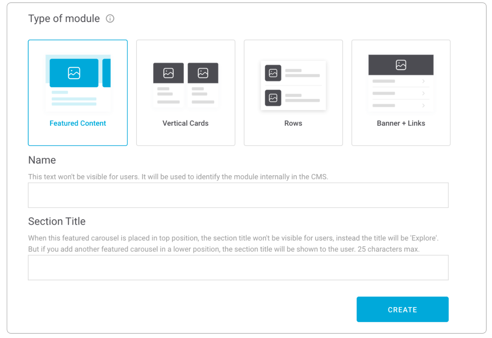
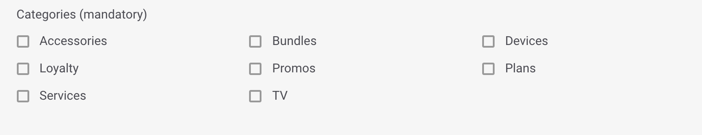

# Crear módulo

Haz clic en el botón **CREATE MODULE**.

Selecciona el tipo de módulo que vas a utilizar para tu diseño.

Los módulos se ven así:

Para el módulo que has seleccionado indica:

**Name**. Nombre que identifica internamente al elemento. En la app no se muestra en ningún momento pero con ese nombre puedes identificar el módulo en la vista de listado de módulos.

  🔅No tiene una longitud máxima y es **obligatorio**.

**Section Title**. Título que se muestra encima del módulo siempre que no esté posicionado en primer lugar. Cuando va en la primera posición, no hay título de sección \(en ese caso el título de sección es siempre _Explore_\). Además, este título sirve para identificar internamente el módulo que estás creando. Con ese título puedes identificar el módulo en la vista de listado de módulos.

🔅Tiene una longitud máxima de **25 caracteres** y es **obligatorio**.


Dentro de un layout, es obligatorio que un módulo de tipo _Featured Content_ esté en primera posición.


Si seleccionas un módulo de tipo **Banner + Links**, indica también:

**Categories**. Categorías que permiten al usuario filtrar el contendido en Explore. Las categorías se muestran en la parte superior, como un carrusel horizontal, de modo que el usuario puede navegar por las categorías y seleccionar la que quiera ver.

Cuando el usuario selecciona una categoría el contenido se muestra ordenado en formato vertical \(en lugar de scroll horizontal\), para que el usuario no se pierda ningún contenido.

Selecciona la categoría o las categorías que aplican a la card que estás configurando:

* **Accessories**. Accesorios: auriculares, fundas, relojes.
* **Bundles**. Paquetes: packs, planes, paquetes de productos.
* **Devices**. Dispositivos: smartphones, tablets.
* **Loyalty**. Fidelización: membresía, contenido de programas de loyalty/fidelización \(Valoriza, Priority, Club Movistar…\)
* **Promos**. Promociones: Contenido promocional que pueda encajar y que es posible que incluso pueda convivir con otras categorías.
* **Plans**. Planes: Tarifas, actualizaciones, planes de precios.
* **Services**. Servicios: servicios de valor añadido \(nuevas funcionalidades\), apps, servicios de TEF. 
* **TV**. Televisión: planes de televisión, contenido destacado.

Haz clic en **CREATE** para continuar. En función del tipo de módulo que has seleccionado configura los campos que correspondan.

