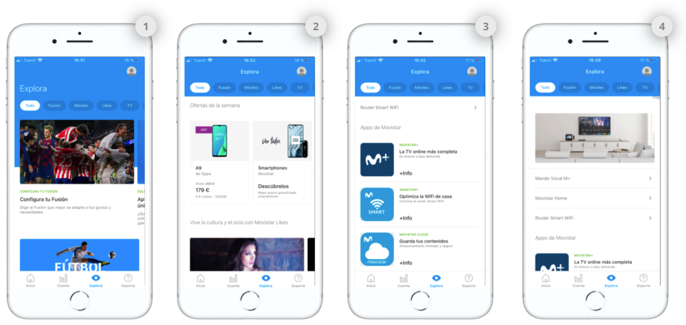

# Crear módulo

Haz clic en el botón **CREATE MODULE**.

Selecciona el tipo de módulo que vas a utilizar para tu diseño.

Los módulos se ven así:


Los campos que se muestran varían en función del tipo de módulo que selecciones.


### Módulo de tipo **Featured Content**, **Vertical Cards** o **Rows**

**Name**. Nombre que identifica internamente al elemento. En la app no se muestra en ningún momento pero con ese nombre puedes identificar el módulo en la vista de listado de módulos. 🔅No tiene una longitud máxima y es **obligatorio**.

**Section Title**. Título que se muestra encima del módulo siempre que no esté posicionado en primer lugar. Cuando va en la primera posición, no hay título de sección \(en ese caso el título de sección es siempre _Explore_\). Además, este título sirve para identificar internamente el módulo que estás creando. Con ese título puedes identificar el módulo en la vista de listado de módulos.  
****🔅Tiene una longitud máxima de **25 caracteres** y es **obligatorio**.


Dentro de un layout, es obligatorio que un módulo de tipo _Featured Content_ esté en primera posición.


### Módulo de tipo  **Banner + Links**

**Name**. Nombre que identifica internamente al elemento. En la app no se muestra en ningún momento pero con ese nombre puedes identificar el módulo en la vista de listado de módulos. 🔅No tiene una longitud máxima y es **obligatorio**.

Para cada _banner_ los campos disponibles varían en función de que selecciones una imagen o un _bumper_:

* **Image**. Muestra una imagen estática.
* **Bumper**. Muestra un vídeo corto o animación.



**Image Upload an image** 📤. URL de la imagen del _banner_. Tiene que tener el formato de URL propio del CMS.

Haz clic en el enlace **Upload an image** 📤 ****y selecciona la imagen directamente desde de tu ordenador. Una vez procesada la subida de la imagen, la URL se autocompleta en el campo de texto.

Cuando la imagen se haya subido se previsualiza justo debajo.



**Bumper Upload a bumper** 📤. Se autorrellena con el nombre del _bumper_.

Para subir un bumper tienes dos opciones: 

1. Haz clic en el enlace **Upload a bumper** 📤 y sube un _bumper_ desde tu ordenador.
2. Despliega la lista de los _bumpers_ y selecciona uno de los que ya haya subidos.

Activa la opción **Play in loop** para que el _bumper_ se reproduzca en bucle en Explore. Con la opción desactivada se reproduce cada vez que el _bumper_ entre en pantalla pero se para cuando termina la reproducción.

Cuando el _bump_e_r_ se haya subido se previsualiza justo debajo:



**Categories**. Categorías que permiten al usuario filtrar el contendido en Explore. Las categorías se muestran en la parte superior, como un carrusel horizontal, de modo que el usuario puede navegar por las categorías y seleccionar la que quiera ver.

Cuando el usuario selecciona una categoría el contenido se muestra ordenado en formato vertical \(en lugar de scroll horizontal\), para que el usuario no se pierda ningún contenido.

Selecciona la categoría o las categorías que aplican a la card que estás configurando:


Las categorías disponibles y los nombres de las categorías varían en función de la OB.


* **Fusión**. Paquetes: packs, planes, paquetes de productos.
* **Móviles**. Dispositivos: smartphones, tablets.
* **Likes**. Fidelización: membresía, contenido de programas de loyalty/fidelización \(Valoriza, Priority, Club Movistar…\)
* **TV**. Televisión: planes de televisión, contenido destacado.
* **Ofertas**. Promociones: Contenido promocional que pueda encajar y que es posible que incluso pueda convivir con otras categorías.
* **Servicios**. Servicios: servicios de valor añadido \(nuevas funcionalidades\), apps, servicios de TEF. 

Haz clic en **CREATE** para continuar. En función del tipo de módulo que has seleccionado configura los campos que correspondan.

