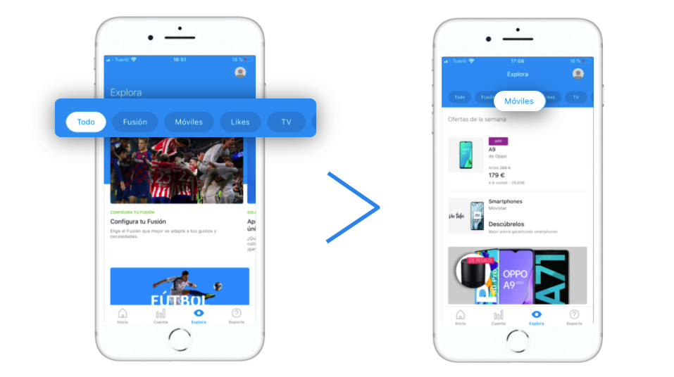

# Banner + links

Los módulos de tipo _Banner_ contienen simplemente una imagen o un _bumper_ con un link.

Rellena los campos obligatorios y decide si necesitas rellenar alguno de los campos opcionales:

## Details

**Name**. Nombre que identifica internamente al elemento. En la app no se muestra en ningún momento pero con ese nombre puedes identificar el módulo en la vista de listado de módulos.‌

​​ 🔅 No tiene una longitud máxima y es **obligatorio**.‌

**For more information check the guidelines**. Consulta las guías de diseño relativas al módulo que estás creando o editando. Revísalas para asegurar que estás subiendo contenido de la mejor calidad posible.

## Module building

### Banner

Para cada _banner_ los campos disponibles varían en función de que selecciones una imagen o un _bumper_:

* **Image**. Muestra una imagen estática.
* **Bumper**. Muestra un vídeo corto o animación.




**Image Upload an image** 📤. URL de la imagen del _banner_. Tiene que tener el formato de URL propio del CMS.

Haz clic en el enlace **Upload an image** 📤 ****y selecciona la imagen directamente desde de tu ordenador. Una vez procesada la subida de la imagen, la URL se autocompleta en el campo de texto.

Cuando la imagen se haya subido se previsualiza justo debajo.

🔅 Este campo es **obligatorio**.

**Image Accesibility Text**. Descripción de la imagen que se usa para la accesibilidad como alternativa si la imagen no se puede mostrar \(por ejemplo, para personas con problemas de visión\).

 🔅 No tiene una longitud máxima y es **opcional**.




**Bumper Upload a bumper** 📤. Se autorrellena con el nombre del _bumper_.

Para subir un bumper tienes dos opciones: 

1. Haz clic en el enlace **Upload a bumper** 📤 y sube un _bumper_ desde tu ordenador.
2. Despliega la lista de los _bumpers_ y selecciona uno de los que ya haya subidos.

Activa la opción **Play in loop** para que el _bumper_ se reproduzca en bucle en Explore. Con la opción desactivada se reproduce cada vez que el _bumper_ entre en pantalla pero se para cuando termina la reproducción.

Cuando el _bump_e_r_ se haya subido se previsualiza justo debajo:

**Bumper Accesibility Text**. Descripción del _bumper_ que se usa para la accesibilidad como alternativa si el _bumper_ no se puede mostrar \(por ejemplo, para personas con problemas de visión\).

🔅 No tiene una longitud máxima y es **opcional**.



 **Action URL**. URL del _banner_, es decir, URL a la que se accede al hacer clic sobre el _banner_.

🔅 Es **obligatoria** y tiene que ser una URL válida \(ejemplo: [`https://www.google.com`](https://www.google.com)\)

**Card Starting date and time**. Fecha y hora en la que quieres que el _banner_ empiece a mostrarse a los usuarios. 

🔅  Es opcional.

**Card Ending date and time**. Fecha y hora en la que quieres que el _banner_ termine de mostrarse a los usuarios.

🔅 Es opcional.

**Card Micro-segments**. Etiquetas que puedes añadir, siempre separadas por comas, para hacer una segmentación de los usuarios que van a ver el contenido que estás creando.

**Categories \(mandatory\)**

Las categorías te permiten filtrar el contendido en Explore. Las categorías se muestran en la parte superior, a modo de carrusel horizontal, de modo que el usuario puede navegar por las categorías y seleccionar la que quiera ver.

Cuando el usuario selecciona una categoría el contenido se muestra ordenado en formato vertical \(en lugar de scroll horizontal\), para que el usuario no se pierda ningún contenido.

En Explore CMS selecciona la categoría o las categorías que aplican a la card que estás configurando:

* **Accessories**. Accesorios: auriculares, fundas, relojes.
* **Bundles**. Paquetes: packs, planes, paquetes de productos.
* **Devices**. Dispositivos: smartphones, tablets.
* **Loyalty**. Fidelización: membresía, contenido de programas de loyalty/fidelización \(Valoriza, Priority, Club Movistar…\)
* **Promos**. Promociones: Contenido promocional que pueda encajar y que es posible que incluso pueda convivir con otras categorías.
* **Plans**. Planes: Tarifas, actualizaciones, planes de precios.
* **Services**. Servicios: servicios de valor añadido \(nuevas funcionalidades\), apps, servicios de TEF. 
* **TV**. Televisión: planes de televisión, contenido destacado.


La categoría **All**, que es la primera que se visualiza, no es una categoría como tal sino que es la forma que tiene el usuario de ver todo el contenido.

Por defecto, cuando un usuario abre Explore, ve todo el contenido, todas las cards configuradas, y por tanto la categoría seleccionada es siempre **All**. 


#### ¿Qué debo tener en cuenta cuando uso las categorías?

¡Consulta la sección [**Categorías**](https://app.gitbook.com/@tef-novum/s/explore-cms/~/drafts/-LyYX2WN5Qc794RVRWmG/faq#categorias) ****del [FAQ](../../faq.md) para resolver todas tus dudas!

### Link

De forma opcional puedes añadir enlaces en la parte inferior del módulo. Para hacerlo rellena, para cada enlace que quieras añadir \(hasta un máximo de 5 enlaces\), los siguientes campos:

**Name**. Nombre del enlace \(ejemplo `Beneficios`\).

🔅 Tiene una longitud máxima de **38 caracteres** y es **obligatorio**.

**Action. URL** que se abre al hacer clic sobre el **Name**, es decir, sobre el nombre del enlace.

🔅 Es obligatoria y tiene que ser una URL válida \(ejemplo: [`https://www.google.com`](https://www.google.com)\)

