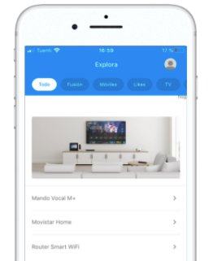
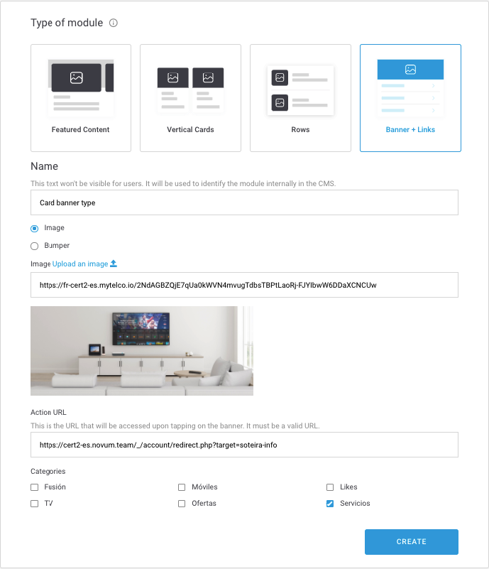

# Banner + links

Los módulos de tipo _Banner_ contienen simplemente una imagen o un _bumper_ con uno o más enlaces \(o _links_\).

Cuando creas un módulo de tipo **Banner + Link** no tienes la opción de crear cards. Desde la pantalla de selección de tipo de módulo indicas ya los datos necesarios para crear el módulo con el banner y un enlace. 

Decide si necesitas rellenar algún campo más:

## Details

**Module Type**. Indica de qué tipo es el módulo que estás configurando o editando.  
 ℹ Campo informativo, no editable.

**Name**. Nombre que identifica internamente al elemento. En la app no se muestra en ningún momento pero con ese nombre puedes identificar el módulo en la vista de listado de módulos.  
🔅 No tiene una longitud máxima y es **obligatorio**.‌

**For more information check the guidelines**. Consulta las guías de diseño relativas al módulo que estás creando o editando. Revísalas para asegurar que estás subiendo contenido de la mejor calidad posible.

## Module building

### Banner

Varios de los campos vienen ya informados del paso anterior \(en la ventana **Type of module**\). En esta pantalla de edición puedes modificar los campos que vienen rellenados y además indicar, si lo consideras, los siguientes campos:

**Image/Bumper Accesibility Text**. Descripción de la imagen o del _bumper_ que se usa para la accesibilidad como alternativa si la imagen o el _bumper_ no se puede mostrar \(por ejemplo, para personas con problemas de visión\).  
🔅 No tiene una longitud máxima y es **opcional**.

**Card Starting date and time**. Fecha y hora en la que quieres que el _banner_ empiece a mostrarse a los usuarios.   
🔅  Es opcional.

**Card Ending date and time**. Fecha y hora en la que quieres que el _banner_ termine de mostrarse a los usuarios.  
🔅 Es opcional.

**Card Micro-segments**. Etiquetas que puedes añadir, siempre separadas por comas, para hacer una segmentación de los usuarios que van a ver el contenido que estás creando.

### Link 1

De forma opcional puedes añadir enlaces en la parte inferior del módulo. Para hacerlo rellena, para cada enlace que quieras añadir \(hasta un máximo de 5 enlaces\), los siguientes campos:

**Name**. Nombre del enlace \(ejemplo `Beneficios`\).

🔅 Tiene una longitud máxima de **38 caracteres** y es **obligatorio**.

**Action. URL** que se abre al hacer clic sobre el **Name**, es decir, sobre el nombre del enlace.

🔅 Es obligatoria y tiene que ser una URL válida \(ejemplo: [`https://www.google.com`](https://www.google.com)\)

