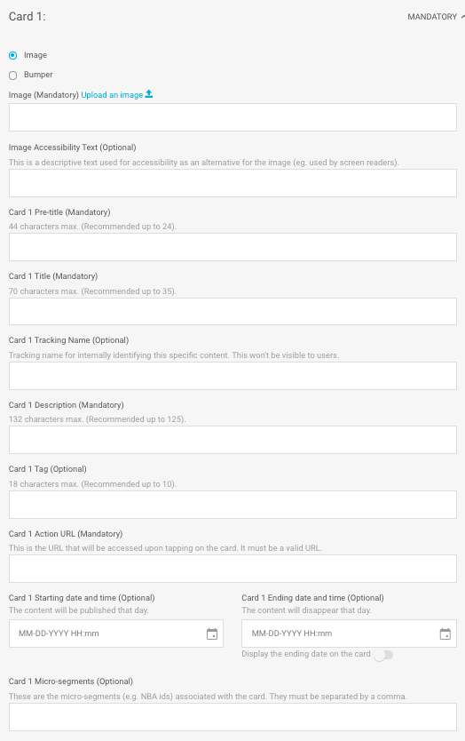

# Featured Content

Es un módulo ideal para resaltar contenido de máximo interés para el usuario limitando el número de elementos que puede ver, con un máximo de 6. 

Los distintos contenidos configurados pasan a modo de carrusel horizontal para que el usuario pueda verlos cómodamente.

Rellena los campos obligatorios y decide si necesitas rellenar alguno de los campos opcionales:

#### Name

Nombre que identifica internamente al elemento. En la app no se muestra en ningún momento pero con ese nombre puedes identificar el módulo en la vista de listado de módulos.

‼ No tiene una longitud máxima y es **obligatorio**.

