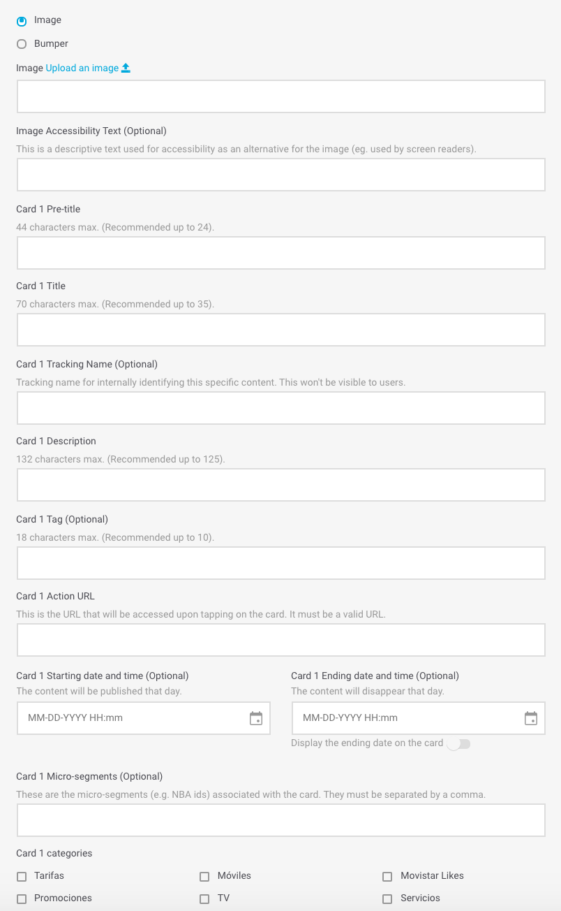

# Featured Content

Módulo ideal para destacar conteúdo relevante para os usuários, limitando o número de elementos que pode visualizar e um máximo de 6.

Os diferentes conteúdos configurados passarão para o modo carrossel horizontal, para que os usuários possam visualizá-los confortavelmente.

Preencha os campos obrigatórios e decida se precisa completar quaisquer dos campos opcionais:

## Details

**Name**. Nome que identifica internamente o elemento. Nunca é exibido no app, mas com esse nome pode identificar o módulo ao visualizar a lista de módulos.

🔅Não há extensão máxima e é **obrigatório**.

**For more information check the guidelines**. Consulte os guias de desenho referentes ao módulo que está criando ou editando. Verifique-os para garantir que o conteúdo que está sendo carregado possui a melhor qualidade possível.

## Module building

**Section Title**. Título mostrado acima do módulo, sempre que não esteja posicionado em primeiro lugar. Quando estiver na primeira posição, não haverá título de seção \(nesse caso, o título de seção sempre será _Explore_\). Ainda, este título serve para identificar internamente o módulo que está sendo criado. Com esse título, você identificará o módulo ao visualizar a lista dos módulos.

🔅A extensão máxima é **25 caracteres** e é **obrigatório**.


Dentro de um layout, é obrigatório que un módulo do tipo _Featured Content_ se encontre na primeira posição.


## Cards

Os _cards_ são as seções que integram o carrossel. Para cada módulo tipo _Featured Content_ configure pelo menos 2 _cards_ e um máximo de 6.

Para cada _card_ os campos disponíveis podem variar segundo for selecionada uma imagem ou um _bumper_:

* **Image**. Exibe uma imagem estática.
* **Bumper**. Exibe um vídeo curto ou animação.

**\*\*💡 \_\_**Você sabia?​\*\*

Um _bumper_ é um vídeo curto ou animação. Em geral, é um formato padrão com duração média aproximada de 6 segundos e costuma ser utilizado em objetivos comerciais.




**Image Upload an image** 📤. URL da imagem do _card_. Deve ter o formato de URL próprio do CMS.

Clique no link **Upload an image** 📤 _\*\*_e selecione a imagem diretamente de seu computador. Uma vez processado o upload da imagem, o URL é preenchido automaticamente no campo de texto.

Quando a imagem for carregada, será possível pré-visualizá-la logo abaixo.

🔅Este campo é **obrigatório**.

**Image Accesibility Text**. Descrição da imagem utilizada para acessibilidade, como alternativa se não é possível exibir a imagem \(por exemplo, para pessoas com problemas de visão\).

🔅Não há extensão máxima e é **opcional**.




**Bumper Upload a bumper** 📤. É preenchido automaticamente com o nome do _bumper_.

Para carregar um bumper, há duas opções:

1. Clique no link **Upload a bumper** 📤 e carregue um _bumper_ de seu computador.
2. Abra a lista dos _bumpers_ e selecione um dos que já foram carregados.

Ative a opção **Play in loop** para que o _bumper_ seja reproduzido em loop no Explore. Com a opção desativada, será reproduzido a cada vez que o _bumper_ acessar a tela, mas para quando finaliza a reprodução.

Quando o _bump\_e\_r_ for carregado, será possível pré-visualizar logo abaixo:

**Bumper Accesibility Text**. Descrição do _bumper_ utilizado para acessibilidade, como alternativa se não é possível exibir o _bumper_ \(por exemplo, para pessoas com problemas de visão\).

🔅Não há extensão máxima e é **opcional**.



**Card 1 Pre-title**. Título que aparece imediatamente abaixo da imagem do carrossel.

🔅A extensão máxima é **44 caracteres** \(recomenda-se menos de 24\) e é **obrigatório**.

**Card 1 Title**. Título que aparece abaixo do **Pre-title** e identifica internamente o _card_.

🔅A extensão máxima é **70 caracteres** \(recomenda-se menos de 35 para não ocupar mais de uma linha\) e é **obrigatório**.

**Card 1 Tracking Name**. Nome que não será visualizado pelos usuários, mas sim no Google Analytics. Serve para uma identificação interna e mais fácil do produto.

🔅É **opcional**.

**Card 1 Description**. Breve descrição do _card_.

🔅A extensão máxima é **132 caracteres** \(recomenda-se menos de 125\) e é **obrigatório**.

**Card 1 Tag**. Texto curto posicionado por cima da imagem do _card_.

🔅A extensão máxima é **18 caracteres** \(recomenda-se menos de 10\) e é **opcional**.

**Card 1 Action Url**. URL do _card_, isto é, URL que é acessada ao clicar no _card_.

🔅É **obligatoria** e deve ser uma URL válida \(por exemplo: ​[https://www.google.com](https://www.google.com)\)

**Card 1 Starting date and time**. Data e hora que você deseja para iniciar a exibição do _card_ aos usuarios.

🔅É opcional.

**Card 1 Ending date and time**. Data e hora que você deseja para iniciar a exibição do _card_ aos usuários.

🔅É opcional.

**Display the ending date on the card**. Ative esta opção para informar o usuário que o conteúdo irá expirar.

**Como é visualizada a data de validade?**

Se a opção de exibir a data de validade estiver habilitada, a exibição dessa data dependerá do dia em que expirar o _card_.

`FINALIZA HOJE hh:mm AM` ou `FINALIZA HOJE hh:mm PM` ou `FINALIZA HOJE hh:mm` \(o formato varia segundo o país\) para indicar que o _card_ expira no mesmo dia na hora indicada, pela manhã ou pela tarde, respectivamente. Por exemplo `FINALIZA HOJE 9:00AM`.

`FINALIZA AMANHÃ` para indicar que a data de validade é o dia seguinte.

`FINALIZA dd mm` para indicar que a diferença é de mais de dois dias. Por exemplo `FINALIZA 30 JUN​`.

🎯 A data de início e finalização é uma maneira de programar algumas campanhas, especialmente naquelas de caráter sazonal.

**Card 1 Micro-segments**. Etiquetas que é possível adicionar, sempre separadas com vírgulas, para realizar uma segmentação dos usuários que observarão o conteúdo que está sendo criado.

🔅É **opcional**.


Lembre-se que deve configurar pelo menos 2 ​_cards_ e no máximo 6.

Os campos são iguais para todos os cards.


**Categorias do cartão 1 \(obrigatório\)**

As categorias permitem filtrar o conteúdo no Explore. As categorias são mostradas na parte superior, como um carrossel horizontal, para que o usuário possa navegar pelas categorias e selecionar aquele que deseja ver.

Quando o usuário seleciona uma categoria, o conteúdo é exibido no formato vertical \(em vez de rolagem horizontal\), para que o usuário não perca nenhum conteúdo.

Em Explore CMS, selecione a categoria ou categorias que se aplicam ao cartão que você está configurando:

* **Accessories**. Acessórios: fones de ouvido, estojos, relógios.
* **Bundles**. Pacotes: pacotes, planos, pacotes de produtos.
* **Devices**. Dispositivos: smartphones, tablets.
* **Loyalty**. Fidelidade: associação, conteúdo de programas de fidelidade / fidelidade \(Valoriza, Priority, Movistar Club ...\)
* **Promos**. Promoções: conteúdo promocional que se encaixa e pode até existir com outras categorias.
* **Plans**. Planos: tarifas, planos, atualizações do plano.
* **Services**. Serviços: serviços de valor agregado \(novos recursos\), aplicativos, e outros serviços de TEF.
* **TV**. Televisão: planos de televisão, conteúdo em destaque.


A categoría **Todos**, que é a primeira a ser exibida, não é uma categoria em si, mas é a maneira do usuário de ver todo o conteúdo.

Por padrão, quando um usuário abre o Explore, ele vê todo o conteúdo, todos os cartões configurados e, portanto, a categoria selecionada é sempre **Todos**.


🎯 **Boas práticas**: não é recomendável atribuir a um conteúdo mais de uma categoria, embora o Explore CMS não limite esse comportamento. No nível de medição de dados

#### O que devo ter em mente ao usar as categorias?

Consulte a seção [**Categorias**](https://app.gitbook.com/@tef-novum/s/explore-cms/~/drafts/-LyYX2WN5Qc794RVRWmG/faq#categorias) das [perguntas frequentes](../../faq.md) para responder a todas as suas perguntas!

### Mudar a ordem dos _cards_

Dentro do módulo, é possível movimentar os cards para mudar a ordem em que são exibidos.

Para movimentar um _card_ arraste-o até a posição onde será exibido e solte-o.

## Link

De maneira opcional, é possível adicionar links que aparecerão na parte inferior do módulo.

Para isso, preencha para cada link que deseja adicionar \(máximo de 5 links\) os campos abaixo:

**Name**. Nome do link \(por exemplo, `Vantagens`\).

🔅 A extensão máxima é **38 caracteres** e é **obrigatório**.

**Action URL.** Link que aparece ao clicar no **Name**​, isto é, no nome do link.

🔅 É obrigatório e deve ser uma URL válida \(por exemplo: [`https://www.google.com`](https://www.google.com)\)

