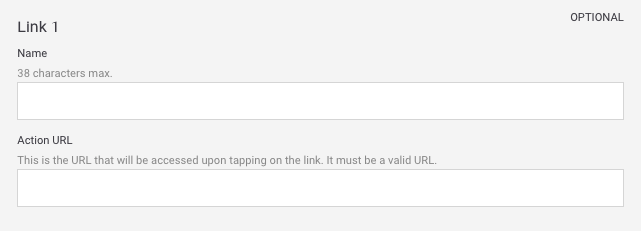

# Featured Content

An ideal module to highlight relevant content for the user, limiting the number of elements that can be viewed, with a maximum of 6.

The various content that has been configured is displayed as a horizontal carousel so that the user can see it comfortably.

Fill in the required fields and decide if you need to fill in any of the optional fields:

## Details

**Name**. Name that internally identifies the element. It is never shown in the app but you can use this name to identify the module in the module list view.

🔅It has no maximum length and is a **required** field.

**For more information check the guidelines**.  Check the design guidelines relating to the module you are creating or editing. Review them to ensure that content of the highest possible quality is being uploaded.

## Module building

**Section Title**. Title that is shown above the module as long as it is not positioned first. When a module is positioned first, there is no section title (in that case the section title is always *Explore*). In addition, this title is used to internally identify the module you are creating. Using this title, you can identify the module in the module list view.

🔅It has a maximum length of **25 characters** and is a **required** field.

 Within a layout, a *Featured Content*​-type module must occupy the first position. 

## Cards

The *cards* are the sections that make up the carousel. For each *Featured Content* module, configure a minimum of 2 *cards* and a maximum of 6.

For each *card* the available fields will vary depending on whether you select an image or a *bumper*:

- **Image**. It displays a static image.
- **Bumper**. It displays a short video or animation.

****💡 __**Did you know?**

A *bumper* is a short video or animation. It is a fairly standard format used in marketing, usually used for commercial purposes and with an average duration of around 6 seconds.

  

**Image Upload an image** 📤. URL of the *card* image. This must be in the CMS's own URL format.

Click on the ​**Upload an image** 📤 link and choose the image you want from your computer. Once the image upload has been processed, the URL will auto-complete in the text field.

When the image has been uploaded it is previewed just below.

🔅 This is a **required** field.

**Image Accesibility Text**. Description of the image that is used for accessibility as an alternative if the image cannot be displayed (for example, for people with vision problems).

🔅It has no maximum length and is an **optional** field. 

 

**Bumper Upload a bumper** 📤. It is auto-filled with the name of the *bumper*.

To upload a bumper you have two options:

1. Click on the **Upload a bumper** 📤 link and upload a *bumper* from your computer.
2. Display the list of *bumpers* and select one of those that have already been uploaded.

Activate the **Play in loop** option for the *bumper* to be played in loop in Explore. If you leave it off, it will play every time the *bumper* is on the screen, but once it has finished it will stop.

When the *bumper* has been uploaded it is previewed just below:

**Bumper Accesibility Text**. Description of the *bumper* that is used for accessibility as an alternative if the *bumper* cannot be displayed (for example, for people with vision problems).

🔅It has no maximum length and is an **optional** field.  

**Card 1 Pre-title**. Title that appears immediately below the image in the carousel.

🔅It has a maximum length of **44 characters** (less than 24 recommended) and is a **required** field.

**Card 1 Title**. Title that appears below the  **Pre-title** and identifies the *card* internally.

🔅It has a maximum length of **70 characters**  (less than 35 recommended so as not to take up more than one line) and is a **required** field.

**Card 1 Tracking Name**. Name that is not seen by users but is seen in Google Analytics. It is used to more easily identify the product internally.

🔅It is an **optional** field.

**Card 1 Description**. Short description of the *card*.

🔅It has a maximum length of **132 characters** (less than 125 recommended) and is a **required** field.

**Card 1 Tag**. Short text that is located above the image of the *card*.

🔅It has a maximum length of **18 characters** (less than 10 recommended) and is an **optional** field.

**Card 1 Action Url**. URL of the *card*, i.e., the URL that can be accessed by clicking on the *card*.

🔅This is a **required** field and has to be a valid URL (for example: [https://www.google.com](https://www.google.com))

**Card 1 Starting date and time**. Date and time you want the *card* to start being displayed to users.

🔅It is an optional field.

**Card 1 Ending date and time**. Date and time you want the *card* to stop being displayed to users.

🔅It is an optional field.

**Display the ending date on the card**. Activate this option to inform the user that the content will expire.

**How is the expiration date displayed?**

If you have enabled the option to show the expiration date, the way in which that date is displayed depends on the day on which the *card* expires.

`ENDS TODAY hh:mm AM` or `ENDS TODAY hh:mm PM` or `ENDS TODAY hh:mm` (format varies depending on the country) to indicate that *card* expires on the same day at the specified time, in the morning or in the afternoon, respectively. For example, `ENDS TODAY at 9:00 AM`.

`ENDS TOMORROW` to indicate that the expiration date is the following day.

`ENDS on dd mm` to indicate that the difference is more than two days. For example `ENDS on 30 JUN`.

🎯 Starting and Ending date and time is a way to program some campaigns and is specifically designed for seasonal campaigns.

**Card 1 Micro-segments**. Tags that you can add, always separated by commas, to make a segmentation of the users who are going to see the content you are creating.

🔅It is an **optional** field.

 Remember that you have to configure a minimum of 2 *cards* and a maximum of 6.

The fields for all the cards are the same. 

**Card 1 categories (mandatory)**

Categories allow you to filter content in Explore. The categories are shown at the top in a horizontal scroll bar, which allows the user to browse by category and choose the one they want to see.

When the user selects a category, the content is shown in a vertical format (as opposed to having to scroll horizontally), so that the user doesn't miss any content.

In Explore CMS, select the category or categories that apply to the card that you are configuring:

- **Accessories**: Earphones, cases, watches.
- **Bundles**: Packs, plans, product packs.
- **Devices**:  Smartphones, tablets.
- **Loyalty**: Membership, loyalty/​retention programmes content (Vivo Valoriza, Priority, Club Movistar, etc.)
- **Promos**: Promotional content that may apply and which may coexist with other categories.
- **Plans**: Tariffs, plans and plan upgrades.
- **Services**: Added value services (new app features), apps, other TEF services.
- **TV**: Television plans, featured content.

 The category **All**, which is the first one that you see, isn't a category as such. Rather, it is the way in which the user can view all the content.

By default, when a user opens Explore he/​she sees all content and all configured cards. As such, the selected category is always **All**. 

🎯 **Buenas prácticas**: We don't recommend assigning more than one category to a content. Explore CMS does not, however, set a limit for the number of categories that can be assigned. On the data measurement level:

#### What should I consider when using the categories?

Consult the [**Categories**](https://app.gitbook.com/@tef-novum/s/explore-cms/%7E/drafts/-LyYX2WN5Qc794RVRWmG/faq#categorias) section of the [FAQ](../../faq.md) to resolve all of your doubts!

### Change the order of the *cards*

Inside the module, you can move the cards to change the order in which they are displayed.

To move a *card*, simply drag it to the place where you want it to be displayed and release.

## Link

You can choose to add links that will be shown at the bottom of the module.

In order to do so, fill in the following fields for each link you want to add (up to a maximum of 5 links):

**Name**. Name of the link (for example `Benefits`).

🔅 It has a maximum length of **38 characters** and is a **required** field.

**Action URL.**  Link that opens when you click on the ​ **Name**, i.e., on the name of the link.

🔅 This is a required field and has to be a valid URL (for example: [`https://www.google.com`](https://www.google.com))

