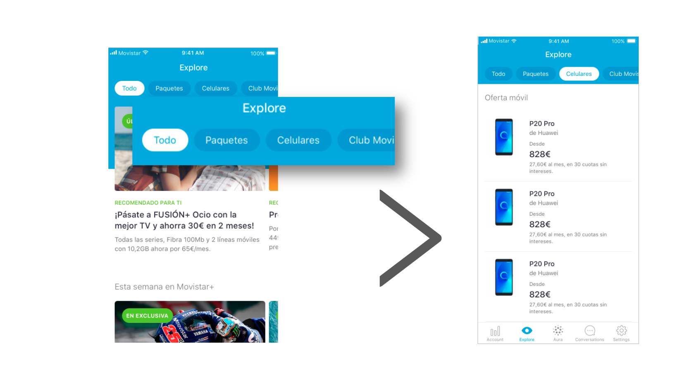
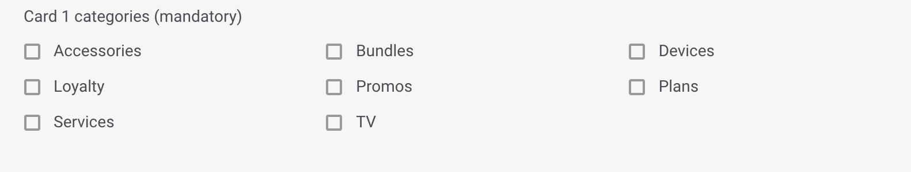

# Rows

Este tipo de módulo está muy orientado a presentar diferentes tarifas a los usuarios aunque puedes usarlo para cualquier contenido que encaje. 

Tiene un formato por filas \(_rows_\) donde en cada una dispone de varios campos opcionales como una pequeña etiqueta que se comporta como un título para esa fila, un breve texto y su enlace correspondiente.

Rellena los campos obligatorios y decide si necesitas rellenar alguno de los campos opcionales:

## Details

**Name**. Nombre que identifica internamente al elemento. En la app no se muestra en ningún momento pero con ese nombre puedes identificar el módulo en la vista de listado de módulos.‌

​🔅 No tiene una longitud máxima y es **obligatorio**.‌

**For more information check the guidelines**. Consulta las guías de diseño relativas al módulo que estás creando o editando. Revísalas para asegurar que estás subiendo contenido de la mejor calidad posible.

## Module building

**Section Title**. Título que se muestra encima del módulo. Además, este título sirve para identificar internamente el módulo que estás creando. Con ese título puedes identificar el módulo en la vista de listado de módulos.

 🔅 Tiene una longitud máxima de **25 caracteres** y es **obligatorio**.

## Cards

Configura un mínimo de 2 filas y un máximo de 3. Para cada fila los campos disponibles son:

**Row 1 Image URL - Upload an image** 📤 . URL de la imagen de la fila. Tiene que tener el formato de URL propio del CMS.

Haz clic en el enlace **Upload an image** 📤 y selecciona la imagen directamente desde de tu ordenador. Una vez procesada la subida de la imagen, la URL se autocompleta en el campo de texto.

Cuando la imagen se haya subido se previsualiza justo debajo.

🔅 No tiene una longitud máxima y es **obligatorio**. 

**Row 1 Image Accesibility Text**. Descripción de la imagen que se usa para la accesibilidad como alternativa si la imagen no se puede mostrar \(por ejemplo, para personas con problemas de visión\).

🔅 No tiene una longitud máxima y es **opcional**. 

**Row 1 Pre-title**. Pequeño texto destacado previo al título \(ejemplo `30 DÍAS GRATIS`\). 

🔅 Tiene una longitud máxima de **27 caracteres** \(recomendado menos de 24\) y es **opcional**.

**Row 1 Title**. Título de la oferta/plan que aparece al lado de la imagen \(ejemplo: `Plan BIG 20 Gigas`\). 

🔅Tiene una longitud máxima de **25 caracteres** \(recomendado menos de 23\) y es **obligatorio**.

**Card 1 Tracking Name**. Nombre que no ven los usuarios pero sí se ve en Google Analytics. Sirve para identificar el producto internamente de manera más fácil.

🔅Es **opcional**.

**Row 1 Description**. Breve descripción del producto presentado. La descripción se muestra debajo del título.

🔅Tiene una longitud máxima de **34 caracteres** \(recomendado menos de 32\) y es **obligatorio**.

**Row 1 Price**. Precio que se muestra debajo de la descripción, junto a la imagen. No olvides indicar siempre un precio válido \(ejemplo `$123`\)

No tiene una longitud máxima y es **obligatorio**.

**Row 1 Price Information**. Texto para aportar información adicional acerca del precio. Se muestra junto al precio, con un estilo más discreto y precedido de `/` \(ejemplo `al mes`\). 

🔅Tiene una longitud máxima de **12 caracteres** \(estos caracteres incluyen también el **Row 1 Price**\) y es **opcional**.

**Row 1 Action URL**. URL de la fila, es decir, URL a la que se accede al hacer clic sobre la fila.

🔅Es **obligatoria** y tiene que ser una URL válida \(ejemplo: [`https://www.google.com`](https://www.google.com)\)

**Card 1 Starting date and time**. Fecha y hora en la que quieres que la fila empiece a mostrarse a los usuarios. 

🔅Es opcional.

**Card 1 Ending date and time**. Fecha y hora en la que quieres que la fila __termine de mostrarse a los usuarios.

🔅Es opcional.

**Display the ending date on the card**. Activa esta opción para informar al usuario que el contenido va a caducar. 

**¿Cómo se visualiza la fecha de caducidad?**

Si has habilitado la opción de mostrar la fecha de caducidad, cómo se muestre esa fecha depende del día en que expire la _card_.

`TERMINA HOY hh:mm AM` o `TERMINA HOY hh:mm PM` o `TERMINA HOY hh:mm` \(el formato varía en función del país\) para indicar que la _card_ caduca en el mismo día a la hora indicada, por la mañana o por la tarde, respectivamente. Por ejemplo `TERMINA HOY 9:00AM`.

`MAÑANA` indica que la fecha de caducidad es al día siguiente. 

`TERMINA dd mm` para indicar que la diferencia es de más de dos días. Por ejemplo `TERMINA 30 JUN`.

🎯 La fecha de comienzo y fin son una manera de programar algunas campañas, especialmente aquellas de carácter estacional.

**Card 1 Micro-segments**. Etiquetas que puedes añadir, siempre separadas por comas, para hacer una segmentación de los usuarios que van a ver el contenido que estás creando.

🔅Es **opcional**.

**Card 1 categories \(mandatory\)**

Las categorías te permiten filtrar el contendido en Explore. Las categorías se muestran en la parte superior, a modo de carrusel horizontal, de modo que el usuario puede navegar por las categorías y seleccionar la que quiera ver.

Cuando el usuario selecciona una categoría el contenido se muestra ordenado en formato vertical \(en lugar de scroll horizontal\), para que el usuario no se pierda ningún contenido.

En Explore CMS selecciona la categoría o las categorías que aplican a la card que estás configurando:

* **Accessories**. Accesorios: auriculares, fundas, relojes.
* **Bundles**. Paquetes: packs, planes, paquetes de productos.
* **Devices**. Dispositivos: smartphones, tablets.
* **Loyalty**. Fidelización: membresía, contenido de programas de loyalty/fidelización \(Valoriza, Priority, Club Movistar…\)
* **Promos**. Promociones: Contenido promocional que pueda encajar y que es posible que incluso pueda convivir con otras categorías.
* **Plans**. Planes: Tarifas, actualizaciones, planes de precios.
* **Services**. Servicios: servicios de valor añadido \(nuevas funcionalidades\), apps, servicios de TEF. 
* **TV**. Televisión: planes de televisión, contenido destacado.


La categoría **All**, que es la primera que se visualiza, no es una categoría como tal sino que es la forma que tiene el usuario de ver todo el contenido.

Por defecto, cuando un usuario abre Explore, ve todo el contenido, todas las cards configuradas, y por tanto la categoría seleccionada es siempre **All**. 


#### ¿Qué debo tener en cuenta cuando uso las categorías?

¡Consulta la sección [**Categorías**](https://app.gitbook.com/@tef-novum/s/explore-cms/~/drafts/-LyYX2WN5Qc794RVRWmG/faq#categorias) ****del [FAQ](../../faq.md) para resolver todas tus dudas!

