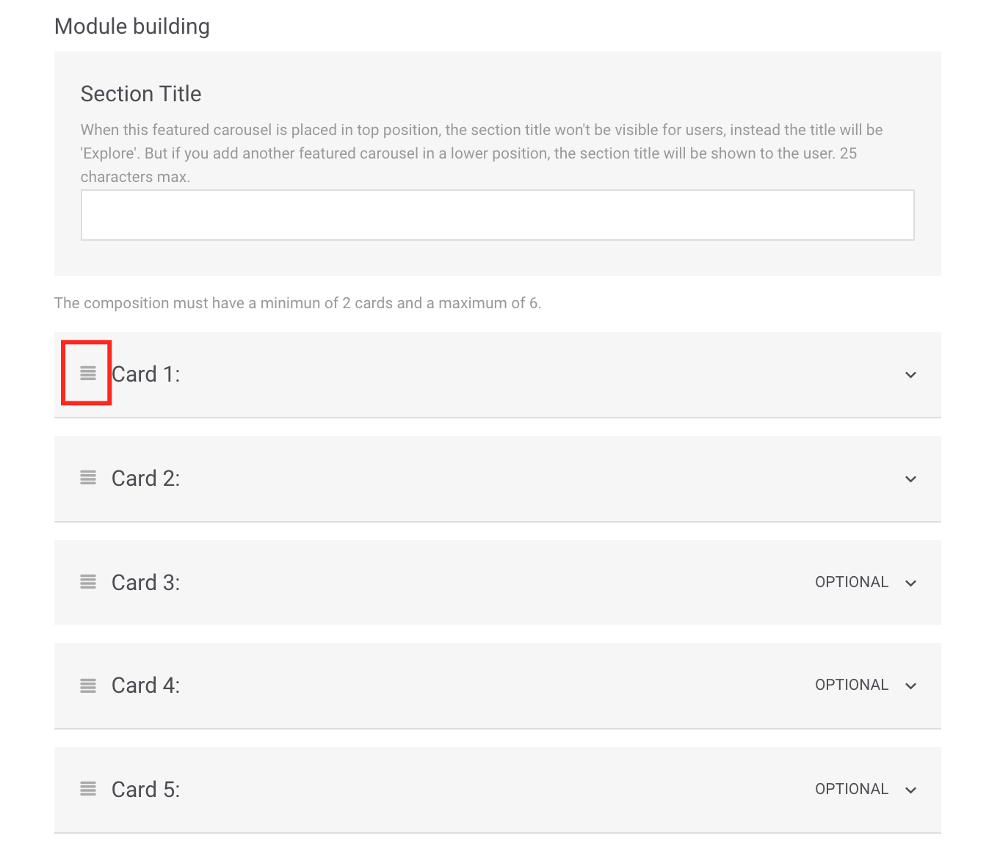
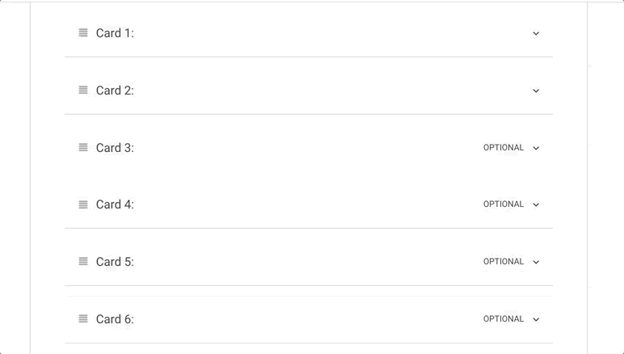
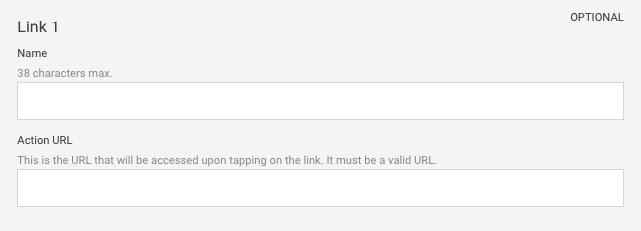
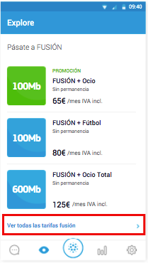

# Rows

Este tipo de módulo está fortemente orientado a apresentar diferentes tarifas aos usuários, mas você pode utilizá-lo para qualquer conteúdo que possa combinar.

Possui um formato com fileiras \(_rows_\) e, em cada uma delas, há vários campos opcionais. Por exemplo, uma pequena etiqueta que atua como título para essa fileira, um breve texto e seu link correspondente.

Preencha os campos obrigatórios e decida se precisa completar quaisquer dos campos opcionais:

## Details

**Name**. Nome que identifica internamente o elemento. Nunca é exibido no app, mas com esse nome pode identificar o módulo ao visualizar a lista de módulos.‌

​🔅 Não há extensão máxima e é **obrigatório**.‌

**For more information check the guidelines**. Consulte os guias de desenho referentes ao módulo que está criando ou editando. Verifique-os para garantir que o conteúdo que está sendo carregado possui a melhor qualidade possível.

## Module building

**Section Title**. Título mostrado acima do módulo. Também, o título serve para identificar internamente o módulo que está criando. Com esse título, você pode identificar o módulo ao visualizar a lista de módulos.

🔅 A extensão máxima é **25 caracteres** e é **obrigatório**.

## Cards

Configure pelo menos 2 fileiras e um máximo de 3. Os campos disponíveis para cada fileira são:

**Row 1 Image URL - Upload an image** 📤 . URL da imagem da fileira. Deve ter o formato de URL próprio do CMS.

Clique no link **Upload an image** 📤 e selecione a imagem diretamente de seu computador. Uma vez processado o upload da imagem, o URL é preenchido automaticamente no campo de texto.

Quando a imagem for carregada, será possível pré-visualizá-la logo abaixo.

🔅 Não há extensão máxima e é **obrigatório**.

**Row 1 Image Accesibility Text**. Descrição da imagem utilizada para acessibilidade, como alternativa se não é possível exibir a imagem \(por exemplo, para pessoas com problemas de visão\).

🔅 Não há extensão máxima e é **opcional**.

**Row 1 Pre-title**. Breve texto em destaque prévio ao título \(por exemplo: `30 DIAS GRÁTIS`\).

🔅 A extensão máxima é **27 caracteres** \(recomenda-se menos de 24\) e é **opcional**.

**Row 1 Title**. Título da oferta/​plano que aparece ao lado da imagem \(por exemplo: `Plano BIG 20 Gigas`\).

🔅A extensão máxima é **25 caracteres** \(recomenda-se menos de 23\) e é **obrigatório**.

**Card 1 Tracking Name**. Nome que não será visualizado pelos usuários, mas sim no Google Analytics. Serve para uma identificação interna e mais fácil do produto.

🔅É **opcional**.

**Row 1 Description**. Breve descrição do produto apresentado. A descrição é exibida abaixo do título.

🔅A extensão máxima é **34 caracteres** \(recomenda-se menos de 32\) e é **obrigatório**.

**Row 1 Price**. Preço exibido abaixo da descrição, juntamente com a imagem. Lembre-se sempre de indicar um preço válido \(por exemplo, `$123`\)

Não há extensão máxima e é **obrigatório**.

**Row 1 Price Information**. Texto para brindar informação adicional sobre o preço. Apresenta-se junto com o preço, em um estilo mais discreto e precedido por `/` \(por exemplo, `mensal`\).

🔅A extensão máxima é **12 caracteres** \(esses caracteres também incluem o **Row 1 Price**\) e é **opcional**.

**Row 1 Action URL**. URL da fileira, isto é, a URL que é acessada ao clicar na fileira.

🔅É **obrigatória** e deve ser uma URL válida \(por exemplo: [`https://www.google.com`](https://www.google.com)\)

**Card 1 Starting date and time**. Data e hora que deseja para iniciar a exibição da fileira aos usuários.

🔅É opcional.

**Card 1 Ending date and time**. Data e hora que deseja que a fileira finalize a exibição para os usuários.

🔅É opcional.

**Display the ending date on the card**. Ative esta opção para informar o usuário que o conteúdo irá expirar.

**Como é visualizada a data de validade?**

Se a opção de exibir a data de validade estiver habilitada, a exibição dessa data dependerá do dia em que expirar o _card_.

`FINALIZA HOJE hh:mm AM` o `FINALIZA HOJE hh:mm PM` ou `FINALIZA HOJE hh:mm` \(o formato varia segundo o país\) para indicar que o _card_ expira no mesmo dia na hora indicada, pela manhã ou pela tarde, respectivamente. Por exemplo `FINALIZA HOJE 9:00AM`.

`AMANHÃ` indica que a data de validade é o dia seguinte.

`TERMINA dd mm` para indicar que la diferencia es de más de dos días. Por ejemplo `TERMINA 30 JUN`.

🎯 A data de início e finalização é uma maneira de programar algumas campanhas, especialmente naquelas de caráter sazonal.

**Card 1 Micro-segments**. Etiquetas que é possível adicionar, sempre separadas com vírgulas, para realizar uma segmentação dos usuários que observarão o conteúdo que está sendo criado.

🔅É **opcional**.

**Categorias do cartão 1 \(obrigatório\)**

As categorias permitem filtrar o conteúdo no Explore. As categorias são mostradas na parte superior, como um carrossel horizontal, para que o usuário possa navegar pelas categorias e selecionar aquele que deseja ver.

Quando o usuário seleciona uma categoria, o conteúdo é exibido no formato vertical \(em vez de rolagem horizontal\), para que o usuário não perca nenhum conteúdo.

Em Explore CMS, selecione a categoria ou categorias que se aplicam ao cartão que você está configurando:

* **Accessories**. Acessórios: fones de ouvido, estojos, relógios.
* **Bundles**.  Pacotes: pacotes, planos, pacotes de produtos.
* **Devices**. Dispositivos: smartphones, tablets.
* **Loyalty**. Fidelidade: associação, conteúdo de programas de fidelidade / fidelidade \(Valoriza, Priority, Movistar Club ...\)
* **Promos**. Promoções: conteúdo promocional que se encaixa e pode até existir com outras categorias.
* **Plans**. Planos: tarifas, planos, atualizações do plano.
* **Services**. Serviços: serviços de valor agregado \(novos recursos\), aplicativos, e outros serviços de TEF.
* **TV**. Televisão: planos de televisão, conteúdo em destaque.


A categoria **Todos**, que é a primeira a ser exibida, não é uma categoria em si, mas é a maneira do usuário de ver todo o conteúdo.

Por padrão, quando um usuário abre o Explore, ele vê todo o conteúdo, todos os cartões configurados e, portanto, a categoria selecionada é sempre **All**.


#### O que devo ter em mente ao usar as categorias?

Consulte a seção [**Categorias**](https://app.gitbook.com/@tef-novum/s/explore-cms/%7E/drafts/-LyYX2WN5Qc794RVRWmG/faq#categorias) das [perguntas frequentes](../../faq.md) para responder a todas as suas perguntas!

### Mudar a ordem dos _cards_

Dentro do módulo, é possível movimentar os cards para mudar a ordem em que são exibidos.

Para movimentar um _card_ arraste-o até a posição onde será exibido e solte-o.

## Link

De maneira opcional, é possível adicionar links que aparecerão na parte inferior do módulo.

Para isso, preencha para cada link que deseja adicionar \(máximo de 5 links\) os campos abaixo:

**Name**. Nome do link \(por exemplo, `Vantagens`\).

🔅 A extensão máxima é **38 caracteres** e é **obrigatório**.

**Action URL.** Link que aparece ao clicar no **Name**, isto é, no nome do link.

🔅 É obrigatório e deve ser uma URL válida \(por exemplo: [`https://www.google.com`](https://www.google.com)\)

