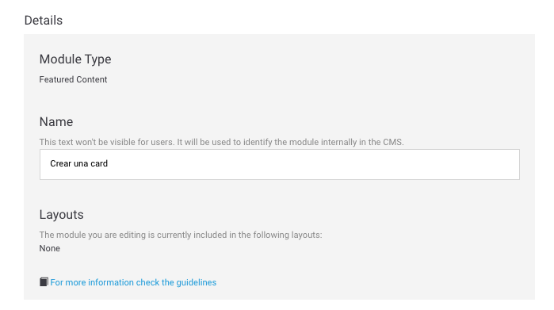
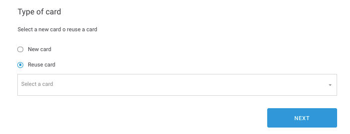
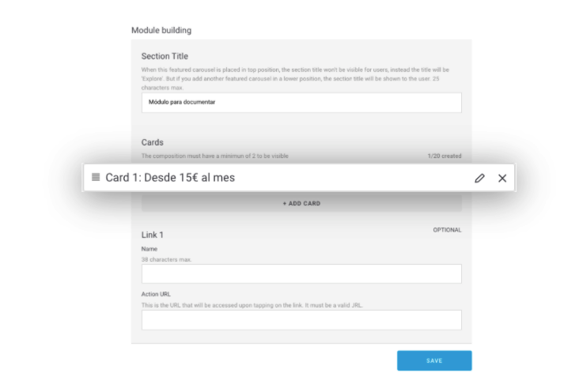

# Rows

Este tipo de módulo está muy orientado a presentar diferentes tarifas a los usuarios aunque puedes usarlo para cualquier contenido que encaje. 

Tiene un formato por filas \(_rows_\) donde en cada una dispone de varios campos opcionales como una pequeña etiqueta que se comporta como un título para esa fila, un breve texto y su enlace correspondiente.

Rellena los campos obligatorios y decide si necesitas rellenar alguno de los campos opcionales:

## Details

**Module Type**. Indica de qué tipo es el módulo que estás configurando o editando.  
 ℹ Campo informativo, no editable.

**Name**. Nombre que identifica internamente al elemento. En la app no se muestra en ningún momento pero con ese nombre puedes identificar el módulo en la vista de listado de módulos.  
 🔅No tiene una longitud máxima y es **obligatorio**.


Este campo viene informado del paso anterior pero puedes modificarlo si lo consideras necesario.


**Layouts.** Campo informativo, no editable, que te indica en qué layouts está incluido el módulo que estás configurando o editando.   
ℹ Campo informativo, no editable.

**For more information check the guidelines**. Consulta las guías de diseño relativas al módulo que estás creando o editando. Revísalas para asegurar que estás subiendo contenido de la mejor calidad posible.

## Module building

**Section Title**. Título que se muestra encima del módulo. Además, este título sirve para identificar internamente el módulo que estás creando. Con ese título puedes identificar el módulo en la vista de listado de módulos.  
🔅Tiene una longitud máxima de **25 caracteres** y es **obligatorio**.

### Cards

Desde esta sección puedes crear una card nueva o puedes usar una card que ya esté creada previamente. En ambos casos haz clic en **+ ADD CARD**.

En la pantalla **Type of card** selecciona una de las opciones:

* **New card**. Selecciona esta opción para crear una nueva card. 
* **Reuse card**. Selecciona una card de las existentes en el desplegable.  Para agilizar tu selección, usa el buscador. Las cards mostradas se van filtrando en función de lo que escribas en el buscador.

Haz clic en **NEXT** para continuar.

Ten en cuenta que los siguientes pasos varían en función de la opción que hayas seleccionado en la ventana Type of card:

#### Si has seleccionado la opción **New card**

Crea una nueva card siguiendo los siguientes pasos 👇 



#### Si has seleccionado la opción Reuse card

Ahora la sección **Module building** contiene la card que has seleccionado en el desplegable **Reuse Card** del paso anterior.

## Link

De forma opcional puedes añadir enlaces que aparecerán en la parte inferior del módulo.

Para hacerlo rellena, para cada enlace que quieras añadir \(hasta un máximo de 5 enlaces\), los siguientes campos:

**Name**. Nombre del enlace \(ejemplo `Beneficios`\).

🔅 Tiene una longitud máxima de **38 caracteres** y es **obligatorio**.

**Action URL.** Enlace ****que se abre al hacer clic sobre el **Name**, es decir, sobre el nombre del enlace.

🔅 Es obligatorio y tiene que ser una URL válida \(ejemplo: [`https://www.google.com`](https://www.google.com)\)

### Cambiar el orden de las _cards_

Dentro del módulo puedes mover las cards para cambiar el orden en el que se muestran. 

Para mover una _card_ arrástrala a la posición en la que quieres que se muestre y suéltala.

