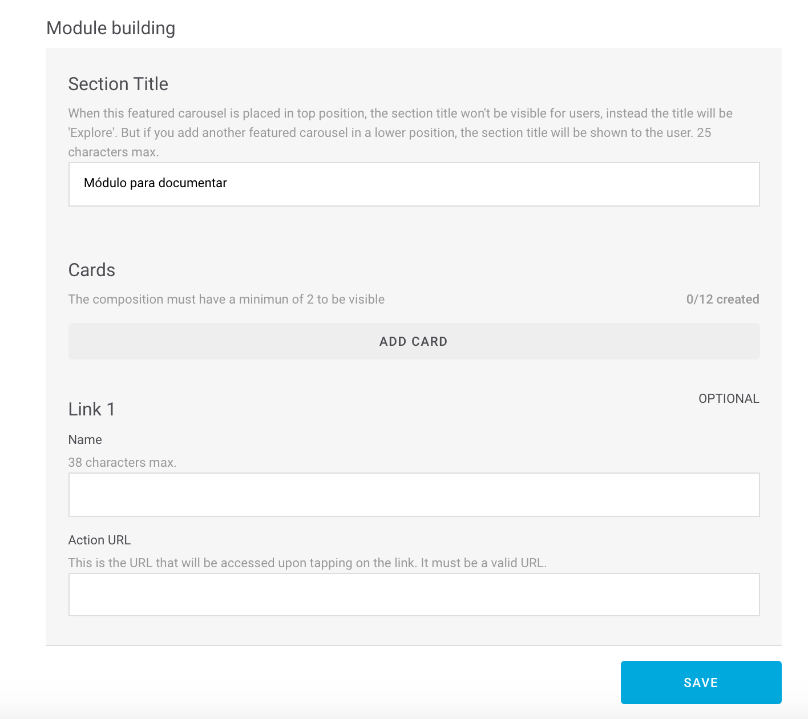
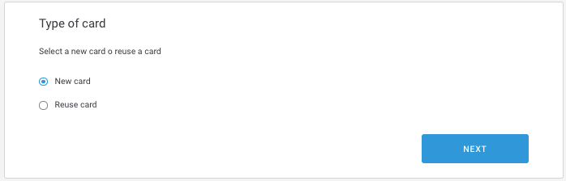

# Crear una card

### Paso 1

Desde el módulo del tipo correspondiente a la card que quieres crear, haz clic en **Add card**.

### Paso 2

Selecciona, en el tipo de card, la opción **New card**. Así creas una card nueva:

Haz clic en NEXT para continuar.

### Paso 3

Indica los campos necesarios de la card. Los campos varían en función del tipo del módulo en el que estés creando la card.

Aquí tienes toda la información 👇 



