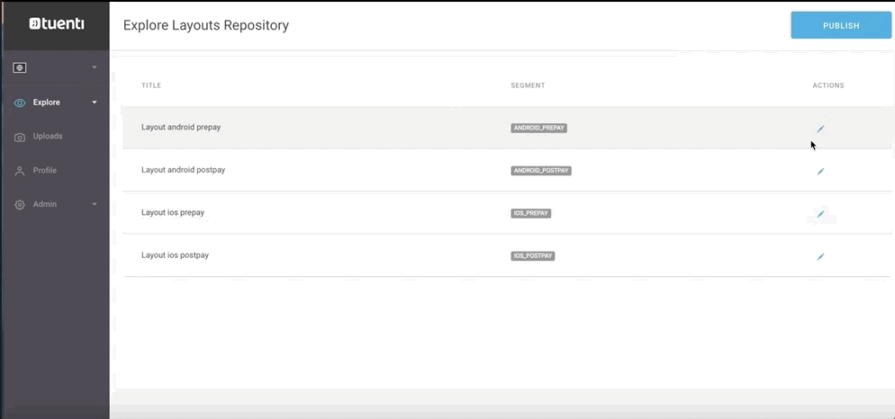

# Editar un layout

### Paso 1

Desde el repositorio de layouts haz clic en en la línea del layout que quieras editar.

### Paso 2

Desde la edición de layout puedes añadir o eliminar módulos o cambiar el orden en el que se muestran en Explore.

### Paso 3

Cuando termines de editar el layout haz clic en **DONE** para guardar los cambios. Ten en cuenta que en este momento los cambios aún están en estado _draft_. Publícalos para que los usuarios de la app puedan verlos.

#### ​​ 🎯 ¿Quieres más información sobre cómo editar layouts?



