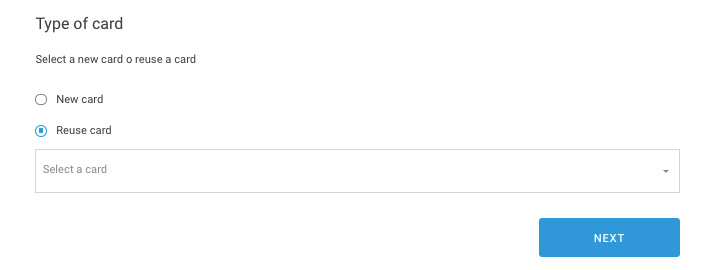

# Reusar una card

### Paso 1

Accede al módulo en el que quieres reusar la card \(puedes [crear un módulo](../../modulo/crear-modulo/) nuevo o [editar un módulo](../../modulo/editar-modulo.md) existente\).

### Paso 2

Haz clic en **ADD CARD** y selecciona la opción **Reuse card**.

### Paso 3

Selecciona la card que quieres usar en el desplegable **Select a card**. Haz clic en **NEXT** para añadirla al módulo.

