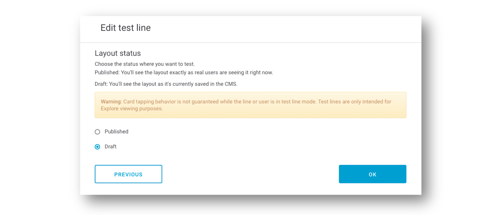

# Test lines

## Previsualizar cambios

Actualmente no existe una versión web para Explore por lo que aún no es posible visualizar directamente cómo queda el contenido antes de su publicación.

No obstante, cada vez que haces un cambio en un layout \(añadir o eliminar un módulo, editar el orden de los módulos\) ese layout pasa a estado **MODIFIED**. En ese estado puedes ver esos cambios desde la app de tu móvil, siempre y cuando hayas facilitado tu número de móvil al equipo de NOVUM de tu OB para que lo puedan meter en una lista concreta y puedas ver los cambios antes de publicar el layout. 

Además, desde **Test lines** puedes ver, desde el mismo dispositivo, diferentes configuraciones en función de los diferentes segmentos, sin necesidad de cambiar de línea o tener varios msisdn.

## Crear una línea de pruebas

Accede al menú **Explore &gt; Test lines** y haz clic en **CREATE A NEW TEST LINE**.

En la ventana **Create test line** rellena los siguientes campos:

**Phone number**. Selecciona en el listado el número de teléfono sobre el que quieres hacer la prueba.

**Layout type**. Selecciona uno o varios layouts para probar el contenido.

**Microsegment**. Indica los microsegmentos que quieres aplicar a tu línea de pruebas. Escribe los nombres de los microsegmentos separados por coma y un espacio.

Ejemplo:

`microsegmento1, microsegmento2, microsegmento3`

🔅 Este campo es opcional.

Haz clic en **NEXT** para continuar. Selecciona el estado en el que realizar la prueba, en función de lo que quieras hacer:

#### Visualizar varios segmentos

* **Published**. Verás el diseño exactamente igual que lo ven los usuarios en ese momento, con la ventaja de que puedes visualizar al mismo tiempo varios segmentos \(los que hayas seleccionado en **Layout type**\), independientemente del segmento de tu línea móvil. 

#### Previsualizar contenido antes de publicar

* **Draft**. Verás el diseño tal y como está guardado en el CMS en ese momento, aunque no esté publicado. Usa esta opción para previsualizar una configuración antes de publicarla y asegurarte de cómo la verán los usuarios.


Ten en cuenta que en modo prueba es posible que algunos enlaces de las _cards_ no funcionen correctamente. 


